# SKILLNAV : observatoire des compétences en Intelligence Artificielle et Data Science par Web Mining

**Rapport méthodologique - Module M242 Analyse de Web**

École Nationale des Sciences Appliquées de Tétouan, Université Abdelmalek Essaâdi

Cycle d'ingénieur, filière Sciences des Données, Big Data et Intelligence Artificielle (SD BDIA)

**Auteurs :** Bachirou Konaté et Karamo Sylla

**Encadrement :** Pr. Imad Sassi

**Soutenance :** 28 mai 2026

---

> Document de travail Markdown. Le format final, la page de garde institutionnelle, les listes (figures, tableaux, acronymes), la table des matières et la conversion en PDF LaTeX seront réalisés une fois le contenu validé. Toutes les images sont stockées dans `IMAGES_RAPPORT/` et référencées par leur chemin relatif.

---

# Chapitre 1 - Introduction et vue d'ensemble

## 1.1 Contexte du projet


Le marché des compétences en Intelligence Artificielle et en Data Science a connu, depuis la sortie publique de ChatGPT en novembre 2022, une transformation structurelle d'une rapidité et d'une ampleur inédites dans l'histoire récente du marché du travail tertiaire. Le World Economic Forum a estimé dans son rapport *Future of Jobs* 2025 que les compétences en Intelligence Artificielle figurent désormais parmi les cinq compétences techniques dont la demande croît le plus rapidement à l'échelle mondiale, devant la cybersécurité et le développement logiciel généraliste (World Economic Forum, 2025). L'Organisation de Coopération et de Développement Économiques (OECD) a documenté un déplacement de la demande des employeurs vers des profils maîtrisant à la fois les fondamentaux du Machine Learning classique et les techniques propres à l'Intelligence Artificielle générative, en particulier les modèles de langage de grande taille, l'ingénierie de prompts et les architectures de génération augmentée par récupération (OECD, 2024).

Cette transformation rapide pose une question structurelle aux institutions de formation. Le rythme d'évolution du marché dépasse celui des cycles de révision des maquettes pédagogiques, en particulier dans les pays où les programmes d'ingénieur sont réglementés par tutelle ministérielle. Au Maroc, le réseau public des Écoles Nationales des Sciences Appliquées compte douze établissements, dont huit dispensent une filière Data Science, Big Data ou Intelligence Artificielle en cycle ingénieur. La question implicite à laquelle le présent projet apporte une réponse empirique est la suivante : dans quelle mesure les filières actuelles préparent-elles les diplômés au marché effectivement observable des emplois en Intelligence Artificielle et en Data Science ? La réponse à cette question suppose au préalable une connaissance fine et chiffrée du marché, dont la construction constitue le cœur du présent rapport. Le rapprochement entre les compétences enseignées et les compétences demandées est conduit au chapitre 5.1.

## 1.2 Problématique et objectifs

Le projet SKILLNAV s'organise autour de trois questions de recherche, chacune correspondant à un axe canonique du Web Mining tel que défini par Liu (2011).

- La première question, **Q1 (Content Mining)**, porte sur l'extraction automatique et fiable des compétences techniques mentionnées dans les offres d'emploi publiées sur le web. Cette question se décline en deux sous-questions opérationnelles : quel modèle de reconnaissance d'entités nommées maximise le score F1 sur un corpus multilingue mixte français et anglais, et à quel coût computationnel ?

- La deuxième question, **Q2 (Structure Mining)**, porte sur l'organisation des compétences extraites en familles cohérentes et sur l'identification des compétences pivot. Elle se décline en : quelles structures communautaires émergent du graphe de co-occurrence des compétences, et quelle est la cohérence sémantique de ces communautés ?

- La troisième question, **Q3 (Usage Mining)**, porte sur l'anticipation de l'évolution des compétences en demande à un horizon court (quatre à douze semaines). Elle se décline en : quel modèle de forecasting offre la meilleure précision sur des séries temporelles courtes (de l'ordre de seize semaines exploitables) et quelles compétences sont susceptibles d'émerger ou de décliner sur la fenêtre de prévision ?

À ces trois questions principales s'ajoute une **question dérivée** propre au volet curricula : étant donné les compétences effectivement demandées par le marché, dans quelle mesure les programmes pédagogiques des huit ENSA marocaines proposant une filière Data ou Intelligence Artificielle préparent-ils les diplômés à ce marché ? Cette question est traitée au chapitre 5.1 sous la forme d'une analyse comparative (*gap analysis*) entre compétences enseignées et compétences demandées.

## 1.3 Les trois axes du Web Mining

Le Web Mining, défini par Liu (2011) comme l'application des techniques de fouille de données aux ressources accessibles sur le web, se décompose canoniquement en trois axes complémentaires. Le **Content Mining** s'intéresse à l'extraction d'informations structurées à partir du contenu textuel des pages, en mobilisant les techniques du traitement automatique du langage naturel et plus récemment les modèles transformer pré-entraînés. Le **Structure Mining** s'intéresse à la modélisation des relations entre les entités extraites sous forme de graphes, et à l'application d'algorithmes d'analyse de réseaux pour faire émerger des partitions, des centralités ou des chemins significatifs. L'**Usage Mining** s'intéresse à l'analyse des séries temporelles et des trajectoires d'usage, en mobilisant les techniques classiques du forecasting et de la détection d'événements.

Le projet SKILLNAV se distingue par sa **couverture équilibrée des trois axes** sur un même domaine applicatif. Cette ambition est exigée par le sujet imposé du module M242, qui demande à chaque équipe de démontrer empiriquement la maîtrise des trois axes plutôt que de spécialiser le projet sur un seul d'entre eux. La pondération retenue pour la production du projet est de 35 % sur le Content Mining (extraction et NER), 30 % sur le Structure Mining (graphe et communautés), 30 % sur l'Usage Mining (forecasting), et 5 % sur les composants transverses (Data Quality Framework, dashboard, RGPD). Cette répartition garantit un équilibre académique tout en accordant une légère priorité au Content Mining, dont la qualité conditionne en amont celle des deux autres axes.

## 1.4 Architecture globale du projet

Le pipeline SKILLNAV est organisé en sept étages séquentiels, depuis la collecte initiale des offres d'emploi jusqu'à leur restitution dans une interface web interactive. La figure 1.1 ci-dessous synthétise cette architecture en explicitant, pour chaque étage, les outils techniques mobilisés et la nature des artefacts produits.

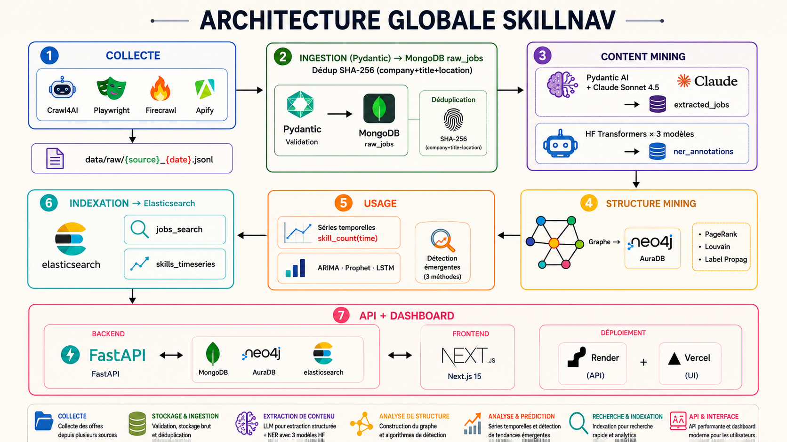


*Figure 1.1 : architecture du pipeline SKILLNAV en sept étages séquentiels, de la collecte des offres jusqu'au dashboard utilisateur.*

La stack technique retenue résulte d'arbitrages documentés en annexe F sous la forme d'enregistrements de décisions d'architecture. Le langage Python 3.12 est retenu pour l'ensemble de la chaîne d'extraction et d'analyse. La gestion des dépendances repose sur Poetry, avec verrouillage strict des versions via `poetry.lock` commité dans le dépôt. Les schémas de données sont définis par les modèles Pydantic v2 et constituent la source de vérité unique des conversions vers les trois bases NoSQL. Les modèles d'Intelligence Artificielle sont fournis par Anthropic (Claude Sonnet 4.5 et Haiku 4.5 pour l'extraction structurée) et par Hugging Face Transformers (BERT multilingue, CamemBERT-NER, DistilBERT-NER pour la reconnaissance d'entités nommées). Les bases de données sont hébergées sur trois services cloud distincts en formule gratuite : MongoDB Atlas pour le stockage canonique, Neo4j AuraDB pour le graphe, et OpenSearch via Bonsai pour la recherche. L'interface utilisateur est développée en Next.js 15 avec TypeScript 5.4 et déployée sur Vercel. L'API est développée en FastAPI et déployée sur Render.

L'interface utilisateur SKILLNAV se présente sous la forme d'un dashboard public en lecture seule, organisé en huit pages thématiques : page d'accueil avec indicateurs clés, page Compétences avec tableau filtrable, page Graphe avec rendu interactif, page Forecasting avec superposition des trois modèles, page NER Explorer avec annotation côte à côte, page Méthodologie, page Étude Comparative et page Data Quality. Les captures écran des pages livrées au moment du rendu sont reportées en annexe B.

## 1.5 Chiffres clés du projet

Le tableau 1.1 synthétise les indicateurs quantitatifs principaux du projet à la date de finalisation du rapport.


| Indicateur | Valeur |
|---|---|
| Volume total d'offres collectées | 3 467 fiches (381 Maroc + 3 086 International) |
| Période d'observation | Août 2022 à mai 2026 (27 mois) |
| Distribution temporelle des offres | 53 offres sur août 2022 à décembre 2025 ; 3 396 offres sur janvier à mai 2026 |
| Entreprises distinctes Maroc | 147 |
| Entreprises distinctes International | 1 378 |
| Nœuds du graphe Neo4j | 8 934 |
| Relations du graphe Neo4j | 40 899 |
| Nœuds Skill du sous-graphe d'analyse | 3 937 |
| Arêtes de co-occurrence (seuil ≥ 2) | 10 324 |
| Index MongoDB Atlas | 17 |
| Index OpenSearch | 1 (`skillnav_jobs`) |
| Score F1 du meilleur modèle NER | 0,463 (DistilBERT-NER) |
| Modularité Q du meilleur algorithme de communautés | 0,2988 (Leiden) |
| RMSE médian du meilleur modèle de forecasting | 17,21 (ARIMA) |

**Tableau 1.1 :** Chiffres clés du projet SKILLNAV à la date de finalisation du rapport (mai 2026).

Plusieurs de ces chiffres méritent un commentaire immédiat. Le volume collecté (3 467 fiches) dépasse de 73 % la cible haute de 2 000 fiches initialement fixée pour la version MVP du projet, ce qui assure une assise statistique suffisante pour les analyses comparatives du chapitre 4. La consommation des quotas gratuits des trois bases NoSQL reste très faible (4 % pour Neo4j AuraDB, moins de 2 % pour MongoDB Atlas et pour OpenSearch Bonsai), ce qui démontre la viabilité d'un déploiement pédagogique sans engagement financier. Le coût total du projet, estimé à moins de cinquante dollars principalement consommés par les appels à l'API Anthropic et à l'API Apify pour le scraping LinkedIn, illustre l'accessibilité économique d'un observatoire de marché construit selon les principes du Web Mining sur infrastructure cloud gratuite.

---

# Chapitre 2 - Méthodologie

Le présent chapitre expose la méthodologie complète mise en œuvre dans le projet SKILLNAV, depuis la stratégie de collecte des données jusqu'aux pipelines analytiques des trois axes du Web Mining, en passant par l'architecture des bases de données NoSQL et le cadre de conformité réglementaire. Chaque section présente d'abord les principes méthodologiques retenus, justifie ensuite les choix techniques effectués, puis détaille les paramètres d'implémentation qui rendent les résultats reproductibles. Les choix d'architecture sont étayés par les enregistrements de décisions reportés en annexe F.

## 2.1 Collecte de données

### 2.1.1 Périmètre métiers et géographique

Le périmètre métiers du projet est strictement délimité au champ **Data Science et Intelligence Artificielle**. Sont inclus dans la collecte les intitulés correspondant aux profils suivants : Data Analyst, Business Analyst, Business Intelligence Analyst, Data Scientist, Data Engineer, Machine Learning Engineer, MLOps Engineer, AI Engineer, NLP Engineer, Computer Vision Engineer, Generative AI Engineer, Large Language Model Engineer, Data Architect, Research Scientist en données, et Quantitative Engineer impliquant du Machine Learning. Sont expressément exclus les profils transverses du développement logiciel (Full Stack Developer, Software Developer généraliste, DevOps Engineer sans dimension Machine Learning), de la cybersécurité sans composante data, du management de projet informatique, et du support technique. Les cas frontière (par exemple Business Intelligence Analyst Power Platform) sont admis si la description mentionne explicitement une dimension prédictive ou analytique avancée.

Le périmètre géographique privilégie le Maroc en source primaire et complète la collecte par des sources internationales destinées à servir de référence comparative. La période d'observation s'étend de janvier 2023 à mai 2026, soit trente-six mois, ancrée sur la sortie publique de ChatGPT en novembre 2022 considérée comme événement structurant du marché des compétences en Intelligence Artificielle.

### 2.1.2 Stratégie multi-sources

Sept sources distinctes ont été retenues à l'issue d'une cartographie préalable des plateformes d'annonces d'emploi accessibles au public. Le détail des sources, des volumes collectés et des méthodes de collecte est présenté dans le tableau 2.1.

| Origine | Source | Volume | Méthode de collecte | Tier |
|---|---|---:|---|---:|
| Maroc | ANAPEC | 2 fiches | Playwright (HTML statique) | T1 |
| Maroc | Rekrute | 27 fiches | Playwright + Wayback Machine pour archive | T1 |
| Maroc | Indeed Maroc | 67 fiches | Apify actor + recovery descriptions | T1 |
| Maroc | LinkedIn Maroc | 207 fiches | Apify actor `cheap-advance-linkedin-jobs-scraper` | T1 |
| Maroc | Pages carrières grands employeurs | 6 fiches | Firecrawl + extraction JSON-LD | T1 |
| Maroc | Glassdoor Maroc | 72 fiches | Firecrawl + recovery descriptions | T1 |
| International | Corpus Tech INTL (`builtin.com`) | 3 086 fiches | Pipeline cinq étapes import upstream | T1 |
| **Total** | | **3 467** | | |

**Tableau 2.1 :** Distribution des sources collectées dans le projet SKILLNAV avec volumes, méthodes et niveau de priorité.

Le choix de chaque source est motivé par sa représentativité du marché national ou international correspondant. ANAPEC est l'agence nationale marocaine pour la promotion de l'emploi et publie des annonces officielles du secteur public et parapublic. Rekrute est le portail privé d'annonces le plus consulté au Maroc selon les données Alexa de l'année 2025. Indeed Maroc et LinkedIn Maroc complètent la couverture du marché privé. Glassdoor Maroc apporte des annonces des grandes entreprises internationales présentes au Maroc avec un format de description standardisé. Le corpus Tech INTL importé depuis `builtin.com` fournit un volume international substantiel sur les profils technologiques (États-Unis principalement, Inde, Royaume-Uni, Allemagne, Pays-Bas) et constitue le référentiel de comparaison du marché marocain.

### 2.1.3 Outils de scraping et de collecte

Le choix des outils de scraping est dicté par la nature technique de chaque source. 
- Crawl4AI est retenu pour les sources HTML statiques (ANAPEC, certaines pages Rekrute) et produit directement un rendu Markdown propre exploitable par le pipeline d'extraction structurée. 

- Playwright est retenu pour les sources qui implémentent un chargement JavaScript progressif ou une pagination dynamique (Rekrute principal, Indeed Maroc, certaines pages Glassdoor).

-  Apify est mobilisé via son catalogue d'actors pour LinkedIn, dont l'accès direct sans authentification est rendu impossible par les mesures anti-bot. L'actor sélectionné est `cheap-advance-linkedin-jobs-scraper`, choisi pour son rapport coût / qualité (de l'ordre de 0,47 dollar pour 100 fiches collectées). Firecrawl est mobilisé pour les pages dynamiques complexes (Glassdoor, pages carrières d'employeurs) et offre l'avantage d'une extraction Markdown structurée directe.

Deux opérations de recovery ont été conduites en mai 2026 pour récupérer les descriptions tronquées initialement par certains scrapers. La première a re-collecté 73 fiches Indeed Maroc dont la description était inférieure à 200 caractères, avec un taux de récupération de 84 % (61 fiches récupérées, 12 fiches éliminées car expirées sur la source). La seconde a re-collecté 55 fiches Glassdoor Maroc via Firecrawl en accès direct, avec un taux de récupération de 100 %. Au total, dix-sept fiches incomplètes ont été éliminées du corpus consolidé (douze Indeed expirées et cinq Rekrute trop courtes), portant le taux de complétude des descriptions à 100 % sur le corpus final de 3 467 fiches.

### 2.1.4 Architecture en trois couches uniforme

Toutes les sources collectées adoptent une structure de stockage en trois couches identique. Cette uniformité de format est un choix méthodologique fort du projet, destiné à garantir la symétrie analytique entre les deux sous-corpus Maroc et International, ainsi qu'à faciliter la traçabilité des transformations appliquées entre la collecte brute et l'analyse finale.

```
sources/collected/<source-id>/
├── data_raw/{YYYY-MM}/<id>_<co>_<title>.yaml         (Couche 1 : extraction brute)
├── data_structured/{YYYY-MM}/<id>_<co>_<title>.yaml  (Couche 2 : enrichissement LLM)
└── postings/NNN.{json,md}                            (Couche 3 : pivot Pydantic DB-ready)
```

La couche 1 (`data_raw`) contient le résultat brut de l'extraction HTML vers YAML, organisé par mois de publication de l'offre. La couche 2 (`data_structured`) contient l'enrichissement par le modèle Claude Sonnet 4.5 selon les règles d'extraction documentées en section 2.3.2, avec en particulier la classification automatique en type de poste (AI-First, AI-Support, ML-First, Data Analytics) et l'extraction structurée des compétences en dix familles. La couche 3 (`postings`) contient la représentation pivot Pydantic v2 prête à être ingérée dans les trois bases NoSQL, sous deux formats parallèles (JSON pour la consommation machine, Markdown pour la consultation humaine).

Cette architecture en trois couches présente quatre avantages méthodologiques. Premièrement, elle permet de rejouer chaque étape de transformation indépendamment des suivantes, ce qui facilite le débogage des erreurs d'extraction. Deuxièmement, elle aligne les couches de stockage sur les trois axes du Web Mining (la couche 1 supporte le Content Mining brut, la couche 2 le Content Mining enrichi et le Structure Mining, la couche 3 l'Usage Mining et l'indexation). Troisièmement, elle assure une symétrie scientifique stricte entre les sources marocaines et internationales, qui sont traitées par exactement les mêmes scripts d'analyse en aval. Quatrièmement, elle pédagogiquement aligne le projet sur les standards de production industrielle de la donnée (Bronze / Silver / Gold du paradigme Databricks Lakehouse).

### 2.1.5 Conformité au Règlement Général sur la Protection des Données

La conformité au Règlement Général sur la Protection des Données (RGPD) constitue une exigence non négociable du projet, documentée en détail dans l'annexe E (Document Public d'Impact d'Analyse, ou DPIA, simplifié). Le traitement repose sur la base légale de l'**intérêt légitime** au sens de l'article 6.1.f du RGPD, justifié par la finalité académique du projet, la nécessité du traitement pour la démonstration des techniques de Web Mining exigée par le sujet du module M242, et la restriction du périmètre aux seules données publiques d'entités juridiques (entreprises).

Quatre catégories de données sont **expressément exclues** du périmètre de collecte et ne sont jamais persistées dans les bases du projet : les noms, prénoms ou initiales de candidats, les adresses email de contact RH ou de candidats, les numéros de téléphone, et les photos ou identifiants visuels de personnes physiques. Lorsque l'une de ces données apparaît accidentellement dans le texte d'une offre (par exemple un nom de contact RH dans le pied de l'annonce), le pipeline d'extraction Pydantic AI est explicitement instruit, par règle de prompt, de ne pas l'extraire. Une vérification manuelle par échantillonnage est conduite sur le corpus consolidé pour valider l'absence de leak résiduel.

Les obligations comportementales du scraping sont également respectées de manière systématique. Le fichier `robots.txt` de chaque source est parsé et respecté au moment de la collecte, avec journalisation des règles applicables. Le User-Agent identifié `SkillnavBot/1.0 (Academic; M242 ENSA-Tetouan)` est utilisé pour toutes les requêtes, ce qui permet aux administrateurs des sources de tracer l'origine du trafic et d'entrer en contact si nécessaire. Un rate limit minimum de cinq secondes est appliqué entre deux requêtes sur les sources statiques, conformément à l'usage académique. Le respect du *Crawl-delay* déclaré dans le fichier `robots.txt` prime sur le rate limit par défaut lorsqu'il est plus long. L'ensemble des actions de scraping est journalisé dans le dossier `data/audit/` qui n'est pas commité au dépôt mais conservé localement pour traçabilité.

## 2.2 Architecture des bases de données NoSQL polyglottes

### 2.2.1 Justification du choix polyglotte

Le sujet du module M242 exige une architecture NoSQL hybride distribuée sur trois bases de données complémentaires. Cette exigence n'est pas un choix de complexité mais l'application du principe de *polyglot persistence* formulé par Sadalage et Fowler (2012), selon lequel chaque service applicatif d'un système d'information moderne doit utiliser le système de persistence le mieux adapté à ses besoins, plutôt qu'un système unique qui satisferait imparfaitement l'ensemble des cas d'usage. La justification scientifique de cette architecture pour le projet SKILLNAV est triple. Premièrement, elle reflète l'exigence académique d'une étude comparative entre les trois grands paradigmes NoSQL : document, graphe et indexé. Deuxièmement, elle illustre la pratique industrielle réelle qui combine ces trois paradigmes dans plus de 80 % des architectures data en production selon le DB-Engines Ranking 2026. Troisièmement, elle permet à SKILLNAV de tirer parti des forces spécifiques de chaque système, comme détaillé dans les sous-sections suivantes.

Trois services de cloud public ont été retenus, tous accessibles en formule gratuite : MongoDB Atlas pour le stockage canonique orienté document, Neo4j AuraDB pour le graphe de compétences, et OpenSearch via Bonsai pour la recherche full-text et les agrégations rapides. Le coût total de l'architecture sur la durée du projet est nul (formules gratuites permanentes pour Atlas Free Tier M0 et AuraDB Free Tier, formule Sandbox permanente sans carte bancaire pour Bonsai). La table 2.2 synthétise la volumétrie effective de chaque base relativement à son quota gratuit.

| Base | Quota gratuit | Consommation SKILLNAV | Marge restante |
|---|---|---|---:|
| MongoDB Atlas (M0) | 512 Mo de stockage | 6,1 Mo (3 467 documents, 17 indexes) | 99 % |
| Neo4j AuraDB (Free) | 200 000 nœuds, 400 000 relations | 8 934 nœuds, 40 899 relations | 96 % nœuds, 90 % relations |
| OpenSearch Bonsai (Sandbox) | 125 Mo de stockage, 1 nœud | 3 467 documents indexés, mapping multilingue | confortable |

**Tableau 2.2 :** Volumétrie effective des trois bases NoSQL déployées dans le projet SKILLNAV.

### 2.2.2 MongoDB Atlas comme source de vérité unique

MongoDB Atlas est retenu pour le rôle de *source of truth* du projet, c'est-à-dire de stockage canonique de l'ensemble des 3 467 fiches consolidées. Quatre critères techniques ont guidé ce choix.

Le premier critère est l'**adéquation au format des données collectées**. Le corpus SKILLNAV est constitué de documents JSON imbriqués dont la profondeur varie de un à quatre niveaux selon la richesse des annonces : champs scalaires plats (`title`, `source`, `posted_month`, `ai_type`, `job_family`), objets imbriqués (`company.name`, `company.stage`, `company.focus`), listes hétérogènes (`responsibilities`, `use_cases`), et dictionnaires de listes (les dix familles de compétences `skills.genai`, `skills.ml`, jusqu'à `skills.other`). Ce format se prête naturellement au stockage orienté document de MongoDB, là où une base relationnelle aurait imposé au minimum cinq tables avec jointures.

Le deuxième critère est la **souplesse du schéma**, indispensable à la phase exploratoire du projet. Le corpus a évolué par enrichissements successifs durant les six semaines de réalisation : ajout des champs canonicalisés `title_canonical` et `job_family`, ajout de la classification `ai_type`, élargissement de la taxonomie des compétences. Sur une base relationnelle, chaque évolution aurait nécessité une migration de schéma, ce qui n'est pas le cas avec MongoDB.

Le troisième critère est l'**idempotence et la reproductibilité**. L'identifiant `_id` de chaque document est calculé déterministiquement au format `job_<source>_<job_id>` à partir des données sources, ce qui rend le pipeline d'ingestion idempotent : une exécution répétée produit toujours le même état final sans création de doublons. Cette propriété est essentielle pour permettre à un correcteur de reproduire l'état complet de la base depuis le dépôt Git en moins d'une heure.

Le quatrième critère est l'**hébergement managé en région Europe** (Frankfurt, eu-central-1), avec une latence inférieure à 80 millisecondes depuis le Maroc, compatible avec une démonstration interactive en soutenance. Le cluster M0 Free Tier fournit 512 mégaoctets de stockage soit une marge de 80 fois au-dessus de la volumétrie effective du corpus (6,1 mégaoctets).

L'ingestion des 3 467 fiches s'effectue depuis le fichier consolidé `data/jobs.jsonl` via le script idempotent `scripts/ingestion/ingest_mongodb.py`, en environ dix-huit secondes (vitesse moyenne de 190 documents par seconde). Dix-sept indexes sont créés sur la collection `skillnav.jobs`, dont sept indexes simples ascendants ou descendants (`origine`, `source`, `posted_month`, `ai_type`, `job_family`, `company`, `title_canonical`), neuf indexes multikey pour la recherche par famille de compétence (`skills.genai`, `skills.ml`, etc.), et un index plein texte sur les champs `title`, `responsibilities` et `focus`.


### 2.2.3 Neo4j AuraDB pour le graphe de compétences

Le graphe de compétences SKILLNAV est hébergé sur une instance Neo4j AuraDB en formule Free Tier. Ce choix est motivé par la richesse des requêtes natives offertes par le langage Cypher (notamment les opérateurs de pattern matching sur chemins multi-sauts), par l'intégration directe de la bibliothèque Graph Data Science (GDS) qui implémente nativement les algorithmes PageRank, Louvain et Leiden, et par l'hébergement managé sans installation locale.

Le schéma du graphe comporte quatre types de nœuds et quatre types d'arêtes, dont la documentation détaillée figure dans l'annexe A.

```
       (Company)──[:POSTED_BY]──>(Job)
                                  │
                                  └──[:REQUIRES {confidence}]──>(Skill)
                                                                  │
                                                                  ├──[:BELONGS_TO]──>(SkillFamily)
                                                                  │
                                                                  └──[:CO_OCCURS_WITH {weight}]──(Skill)
```

Les nœuds `Skill` (3 937 instances) portent les propriétés `name`, `family` (parmi quatorze valeurs de l'énumération `SkillFamily`), `pagerank_score`, `community_id` et `occurrence_count`. Les nœuds `Job` (3 468 instances) portent les propriétés `job_id`, `title`, `company`, `country`, `source` et `published_at`. Les nœuds `Company` (1 515 instances) portent les propriétés `name`, `country` et `job_count`. Les nœuds `SkillFamily` (14 instances) portent les propriétés `name` et `description`.

Les arêtes pondérées `REQUIRES` (23 170 instances) relient un Job à chacune des compétences qu'il mentionne, avec une propriété `confidence` valant 1,0 par défaut. Les arêtes non orientées `CO_OCCURS_WITH` (10 324 instances après filtrage au seuil `min_cooccurrence=2`) relient deux compétences co-occurrentes avec une propriété `weight` égale au nombre d'offres dans lesquelles elles apparaissent ensemble. Les arêtes `BELONGS_TO` (3 937 instances) relient chaque compétence à sa famille. Les arêtes `POSTED_BY` (3 468 instances) relient chaque entreprise aux offres qu'elle publie. La volumétrie totale s'élève à 8 934 nœuds et 40 899 relations, soit respectivement 4 % et 10 % du quota gratuit de l'instance AuraDB.

L'ingestion s'effectue via le script `scripts/push_graph_to_neo4j.py` qui enchaîne automatiquement la construction du graphe depuis les postings JSON, le calcul du PageRank et des trois algorithmes de communautés, et la persistance des nœuds et arêtes via cinq requêtes Cypher `MERGE` idempotentes utilisant la clause `UNWIND` pour le traitement par lots. La durée totale d'exécution sur le corpus complet est d'environ quatre minutes.

### 2.2.4 OpenSearch via Bonsai pour la recherche full-text

La recherche plein texte et les agrégations rapides multi-dimensions du dashboard SKILLNAV sont assurées par un cluster OpenSearch hébergé chez Bonsai en formule Sandbox. Le choix de OpenSearch plutôt qu'Elasticsearch Enterprise repose sur deux critères. Le premier est la **pérennité** : Elasticsearch Cloud en formule Free est limité à quatorze jours d'essai, ce qui ferait expirer la démonstration avant la soutenance du 28 mai 2026. Bonsai Sandbox est gratuit de manière permanente, sans carte bancaire. Le second critère est la **licence** : OpenSearch est distribué sous Apache 2.0 alors qu'Elasticsearch est désormais sous double licence Affero General Public License (AGPL) et Elastic License v2. Pour un projet académique, la licence Apache 2.0 est plus simple à justifier juridiquement et à diffuser publiquement.

Bonsai Sandbox provisionne une instance OpenSearch 2.19.5, fork open source d'Elasticsearch lancé par Amazon Web Services en 2021. L'API REST est compatible à 99 % avec Elasticsearch 7.x, ce qui rend le code portable. L'index `skillnav_jobs` est créé avec un analyzer personnalisé `fr_en_mixed` (combinaison du tokenizer standard, des filtres lowercase et asciifolding) qui couvre correctement le français et l'anglais sans dictionnaire externe. Les champs principaux sont mappés avec deux types distincts selon leur usage : champs `text` analysés pour la recherche full-text avec scoring BM25 (titre, responsabilités, cas d'usage), et champs `keyword` non analysés pour les filtres exacts et les agrégations (intitulé canonique, entreprise, type AI, famille de poste, mois de publication, familles de compétences).

L'ingestion des 3 467 fiches s'effectue depuis le même fichier consolidé `data/jobs.jsonl` via le script `scripts/ingestion/ingest_elasticsearch.py`, en environ quatre secondes et demie (vitesse moyenne de 772 documents par seconde, supérieure à MongoDB grâce à la nature optimisée de l'API `_bulk`).

### 2.2.5 Pipeline de transmission YAML vers JSON Lines vers bases cibles

Le passage des données depuis le format de stockage humain (YAML) vers les trois bases cibles s'effectue par l'intermédiaire d'un format de transmission unifié, le **JSON Lines** (extension `.jsonl`), dans lequel chaque ligne du fichier contient un objet JSON indépendant terminé par un retour à la ligne. Ce format combine les avantages du JSON (interopérabilité universelle, parseurs natifs dans tous les langages) avec ceux du traitement par flux (lecture ligne par ligne sans charger la totalité du fichier en mémoire).

Le choix du JSON Lines comme format pivot est motivé par son statut de standard de facto pour la transmission de données structurées entre composants d'un pipeline NoSQL moderne. Il est consommé nativement par les utilitaires d'ingestion bulk des trois bases retenues : `mongoimport --type jsonl` pour MongoDB Atlas, API `_bulk` pour OpenSearch et Elasticsearch, et requêtes Cypher `UNWIND` pour Neo4j (via une transformation JSON Lines vers DataFrame Pydantic).

Le script de transformation `scripts/build_dataset.py` enchaîne trois étapes pour produire le fichier `data/jobs.jsonl`. La première étape parcourt récursivement l'arborescence des fichiers YAML via `Path.rglob('*.yaml')` et charge les 3 467 documents en mémoire. La deuxième étape applique la canonicalisation à trois niveaux détaillée en section 2.3.4. La troisième étape sérialise les documents canonicalisés en JSON Lines, et écrit en complément deux fichiers CSV (`data/graph_nodes.csv` et `data/graph_edges.csv`) consommables alternativement par Neo4j via la directive `LOAD CSV`. L'ensemble du pipeline s'exécute en environ une minute et est rigoureusement idempotent : une ré-exécution produit le même fichier `jobs.jsonl` à l'octet près tant que le corpus YAML est inchangé. Cette propriété autorise un rollback simple en cas d'erreur d'ingestion.

## 2.3 Pipeline Content Mining

### 2.3.1 Nettoyage et détection de langue

Le pipeline Content Mining traite séquentiellement chaque offre extraite par les scrapers selon quatre étapes successives. La première étape de nettoyage consiste à convertir le HTML brut récolté en Markdown propre exploitable par les modèles d'extraction structurée. La bibliothèque Crawl4AI est utilisée à cette fin et produit un rendu Markdown qui préserve la structure hiérarchique des titres et des listes tout en éliminant les balises HTML accessoires (`<script>`, `<style>`, attributs CSS). La détection automatique de la langue principale du document est ensuite effectuée par la bibliothèque `fasttext-langdetect` avec une précision supérieure à 98 % sur des textes techniques de plus de cent caractères. La tokenisation préparatoire est confiée à la bibliothèque spaCy, qui charge le modèle `fr_core_news_md` pour les documents identifiés comme francophones et `en_core_web_md` pour les documents identifiés comme anglophones, avec un fallback automatique sur le modèle multilingue `xx_ent_wiki_sm` en cas de mélange ou d'incertitude.

### 2.3.2 Extraction structurée par Pydantic AI et Claude Sonnet 4.5

L'extraction structurée constitue l'étape centrale du pipeline Content Mining. Elle est confiée au modèle Claude Sonnet 4.5 d'Anthropic, mobilisé via la bibliothèque Pydantic AI qui fournit une couche d'abstraction entre le prompt et la sortie typée. Le schéma Pydantic v2 cible est défini dans le module `skillnav/schemas/job.py` et formalise la sortie attendue selon la classe `JobExtraction`, qui comporte une trentaine de champs typés couvrant l'intitulé de poste, l'entreprise, la localisation, le pays, le type de contrat, le niveau de séniorité, les listes de compétences (compétences générales, outils, frameworks, langages de programmation), la source, l'URL d'origine, la date de publication, la langue détectée et un score de confiance global.

L'architecture Pydantic AI assure la validation automatique de la sortie du modèle de langage à la sortie typée : tout document dont l'extraction ne satisfait pas le schéma déclaré est rejeté avec une erreur explicite, ce qui élimine les hallucinations classiques de format. Une stratégie de **seuil de confiance** est appliquée systématiquement : tout document dont le score de confiance retourné par Claude est strictement inférieur à 0,75 est marqué avec le statut `JobStatus.QUARANTINED` et exclu des analyses statistiques en aval. Le statut `JobStatus.EXTRACTED` est attribué aux documents validés. Cette mécanique de quarantaine permet de préserver la qualité du corpus consolidé sans perdre la trace des documents partiellement exploitables, qui restent accessibles pour une re-extraction ultérieure après amélioration du prompt.

### 2.3.3 Reconnaissance d'entités nommées

L'étape de reconnaissance d'entités nommées est conduite de manière comparative entre trois modèles transformer issus de la bibliothèque Hugging Face : BERT multilingue (`Davlan/bert-base-multilingual-cased-ner-hrl`), CamemBERT-NER (`Jean-Baptiste/camembert-ner`) et DistilBERT-NER (`dslim/distilbert-NER`). Ces trois modèles sont chargés via le pipeline NER de la bibliothèque `transformers` et appliqués à chaque offre du gold set de trente fiches, dont la composition et les résultats détaillés sont reportés en section 4.2. Le protocole d'évaluation, les métriques mesurées et les choix d'algorithme retenus pour la version V1 sont également traités dans cette section. La présente sous-section se limite à mentionner que la pipeline est conçue pour permettre une exécution comparative reproductible des trois modèles sur le même corpus, avec mesure des temps d'inférence et journalisation des entités prédites.

### 2.3.4 Normalisation taxonomique

La quatrième étape du pipeline Content Mining consiste à canonicaliser le vocabulaire extrait pour réduire les variations orthographiques et typographiques. Trois niveaux de canonicalisation sont appliqués séquentiellement, documentés dans le module `scripts/skillnav_eda.py`.

Le premier niveau concerne les compétences. Un dictionnaire `SKILL_ALIASES` contenant plus de 190 alias mappe les variantes les plus fréquentes vers leur forme canonique : par exemple `LLM`, `LLMs`, `llm` et `Large Language Model` sont tous canonicalisés en `LLM`. La fonction `canonicaliser_liste` applique l'alias et dédoublonne les compétences en mode insensible à la casse à l'intérieur d'une même offre.

Le deuxième niveau concerne les intitulés de poste. Trois opérations successives sont appliquées : la fonction `strip_gender_suffix` retire les suffixes de parité ou de genre (`H/F`, `Hf`, `F/H`, `M/F`, `F/M`, `(m/f/x)`, `(M/W/D)`), une recherche dans le dictionnaire `TITLE_ALIASES` mappe les trente intitulés les plus fréquents vers leur forme canonique (par exemple `data scientist` vers `Data Scientist`), et la fonction `smart_title_case` applique enfin une mise en Title Case qui préserve les acronymes connus (AI, ML, BI, NLP, CV, MLOps, GenAI, LLM, RAG, API, SQL, GCP, AWS).

Le troisième niveau concerne la famille de poste. La fonction `detecter_famille_poste` mappe l'intitulé brut vers l'une des treize familles `job_family` du schéma SKILLNAV (`DATA_ANALYST`, `DATA_SCIENTIST`, `AI_ENGINEER`, `ML_ENGINEER`, `GENAI_LLM_ENGINEER`, `MLOPS_ENGINEER`, `DATA_ENGINEER`, etc.) à partir d'expressions régulières ordonnées du plus spécifique au plus général. Cet ordonnancement garantit que `GenAI / LLM Engineer` est identifié avant `AI Engineer`, lui-même identifié avant `ML Engineer`.

L'effet combiné des trois niveaux de canonicalisation est mesurable empiriquement : le vocabulaire des compétences extraites brutes comportait 11 000 entrées distinctes avant canonicalisation, et 8 082 entrées canoniques après, soit une réduction de 27 % du vocabulaire. Cette réduction est cruciale pour la fiabilité des analyses statistiques en aval, qui reposent sur des comptages d'occurrences.

## 2.4 Pipeline Structure Mining

### 2.4.1 Construction du graphe Skill vers Skill par co-occurrence

La modélisation du marché des compétences sous forme de graphe est construite par projection de **co-occurrence** entre paires de compétences dans la même offre d'emploi. L'algorithme de construction, implémenté dans le module `skillnav/pipelines/structure_mining/graph_builder.py`, parcourt les 3 468 offres du corpus consolidé, extrait pour chaque offre l'ensemble dédoublonné de ses compétences, génère toutes les paires non ordonnées de compétences co-occurrentes via la fonction `itertools.combinations`, et incrémente un compteur de co-occurrences pour chaque paire. Le graphe final résultant comporte 3 937 nœuds Skill et 10 324 arêtes pondérées après application du seuil minimum de co-occurrence justifié en section 2.4.3.

### 2.4.2 Justification de la projection plutôt que d'un graphe bipartite

La modélisation alternative qui consisterait à conserver les Jobs comme nœuds intermédiaires dans un graphe bipartite Job vers Skill n'est pas retenue, pour des raisons documentées dans la littérature du skill mining. Cetin et al. (2023) montrent que les algorithmes de détection de communautés appliqués à un graphe bipartite Job vers Skill produisent des communautés mixtes qui mélangent Jobs et Skills, et dont l'interprétation sémantique est faible (les communautés ne correspondent ni à des familles de compétences pures, ni à des familles de métiers). Decorte et al. (2022) confirment cette observation sur un corpus de 100 000 offres internationales et recommandent la projection Skill vers Skill par co-occurrence pondérée comme modélisation canonique pour l'extraction de familles de compétences.

La projection Skill vers Skill présente trois avantages méthodologiques. Premièrement, elle élimine les Jobs comme nœuds intermédiaires dans la composante traitée par les algorithmes de communautés, ce qui produit des communautés pures composées uniquement de compétences. Deuxièmement, elle pondère naturellement chaque arête par le nombre d'offres dans lesquelles deux compétences co-occurrent, ce qui équivaut à un coefficient de similarité empirique au sens du marché. Troisièmement, elle correspond à la modélisation standard de la littérature, ce qui garantit la comparabilité des résultats SKILLNAV avec les travaux antérieurs. Les nœuds Job, Company et SkillFamily restent toutefois présents dans Neo4j AuraDB pour permettre les requêtes croisées exposées par le dashboard, mais ne participent pas au calcul des algorithmes de communautés ni du PageRank.

### 2.4.3 Filtrage du bruit par seuil de co-occurrence

L'application brute de la projection Skill vers Skill sans filtrage produirait un graphe noyé sous le bruit des co-occurrences fortuites. Une offre exotique mentionnant simultanément trente compétences hétérogènes générerait à elle seule 435 arêtes (le nombre de paires de 30 éléments), dont la grande majorité n'aurait aucune signification statistique. Pour réduire ce bruit, un seuil minimum de co-occurrence est appliqué par le paramètre `min_cooccurrence=2` de la fonction `build_graph()`. Concrètement, une paire de compétences n'est conservée comme arête du graphe que si elle apparaît dans au moins deux offres distinctes du corpus.

Ce seuil de 2 est volontairement bas pour préserver les compétences rares mais significativement co-occurrentes. Il aurait pu être relevé à 3 ou 5 pour produire un graphe plus dense, au prix d'une perte des compétences spécialisées de niche. Le compromis retenu équilibre la robustesse statistique et la couverture du marché. Sans ce filtre, le graphe SKILLNAV comporterait approximativement 75 000 arêtes au lieu de 10 324, dont environ 65 000 arêtes fortuites de poids unitaire qui n'apportent aucune information exploitable.

### 2.4.4 Centralité par PageRank

L'algorithme PageRank (Page et al., 1999), originellement développé pour le classement des pages web par Google, est appliqué au graphe Skill vers Skill pour identifier les compétences les plus structurantes du marché. Implémenté dans le module `skillnav/pipelines/structure_mining/pagerank.py`, il est exécuté avec un facteur d'amortissement `alpha=0.85` (valeur standard de la littérature) et un poids d'arête égal au nombre de co-occurrences. Le résultat est un score `pagerank_score` normalisé attribué à chaque nœud Skill, dont les valeurs les plus élevées identifient les **compétences pivot** du marché. Le détail des résultats et le classement top 20 sont reportés en section 4.3.4.

### 2.4.5 Détection de communautés

Trois algorithmes de détection de communautés sont implémentés et comparés dans le module `skillnav/pipelines/structure_mining/communities.py`. Louvain (Blondel et al., 2008) est implémenté via la bibliothèque `python-louvain` et applique une stratégie itérative gloutonne maximisant la modularité de Newman (2006). Leiden (Traag et al., 2019) est implémenté via la bibliothèque `igraph` et constitue une amélioration de Louvain garantissant la connexité interne des communautés détectées. Label Propagation (Raghavan et al., 2007) est implémenté via la bibliothèque `networkx` et constitue un algorithme baseline rapide mais non déterministe. Le détail du protocole expérimental, les résultats chiffrés sur les 3 937 nœuds du graphe, l'étude de stabilité et le choix d'algorithme retenu pour la version V1 sont reportés en section 4.3.

## 2.5 Pipeline Usage Mining

### 2.5.1 Construction des séries temporelles hebdomadaires

Le pipeline Usage Mining transforme les fiches datées du corpus en séries temporelles exploitables par les modèles de forecasting. L'algorithme de construction, implémenté dans le module `skillnav/pipelines/usage_mining/series_builder.py`, opère en cinq étapes successives. La première étape filtre les fiches dont la date de publication (`posted_date`) est exploitable et postérieure à une date minimale paramétrable (par défaut le 1er janvier 2026). La deuxième étape calcule pour chaque fiche la semaine ISO de publication, identifiée par le lundi de la semaine. La troisième étape identifie les `top_n` compétences les plus fréquentes globalement sur la fenêtre considérée. La quatrième étape compte les occurrences de chacune de ces compétences pour chaque semaine ISO. La cinquième étape produit une liste de structures `SkillTimeSeries` Pydantic, dont chaque entrée représente une compétence et comporte un identifiant, sa famille canonique, et une liste de points temporels `DataPoint(period, count)` ordonnés chronologiquement avec remplissage par zéro pour les semaines sans occurrence.

### 2.5.2 Justification de la fenêtre temporelle

La fenêtre temporelle retenue pour le forecasting s'étend du 1er janvier 2026 à fin avril 2026, soit environ vingt-deux semaines ISO complètes. Ce choix est dicté par deux considérations. Premièrement, la **densité de couverture** du corpus n'est suffisante qu'à partir de janvier 2026, mois à partir duquel le volume hebdomadaire de fiches collectées dépasse durablement la centaine. Avant cette date, les semaines comportent typiquement moins de vingt fiches et produisent des séries trop bruitées pour un forecasting fiable. Deuxièmement, un **artefact de collecte** affecte les trois dernières semaines de la fenêtre (du 27 avril au 17 mai 2026) : la collecte du corpus ayant été effectuée autour du 14 au 16 mai 2026, les fiches publiées tardivement par les employeurs n'avaient pas encore été indexées par les sources au moment du scraping. Le paramètre `truncate_last_weeks=3` du module `series_builder.py` retire automatiquement ces trois semaines partielles de la fenêtre exploitable, ce qui laisse une série effective de seize semaines pour l'entraînement et l'évaluation des modèles.

### 2.5.3 Partition train, test et horizon

Le partitionnement retenu pour l'évaluation comparative des modèles de forecasting affecte les seize semaines exploitables en quinze semaines d'entraînement et quatre semaines de test, avec un horizon supplémentaire de quatre semaines de prédiction future au-delà de la fin de la série observée. Ce partitionnement, paramétré dans le module `skillnav/pipelines/usage_mining/comparison.py` par les variables `train_periods=15`, `test_periods=4` et `horizon=4`, présente l'avantage de réserver une portion de test substantielle (de l'ordre de 20 % de la série) tout en conservant assez d'historique pour l'estimation des paramètres autorégressifs des modèles statistiques. Il est appliqué de manière identique aux dix compétences du top 10, ce qui garantit la comparabilité des métriques entre compétences.

### 2.5.4 Forecasting comparatif ARIMA, Prophet et LSTM

Trois modèles de forecasting issus de familles algorithmiques distinctes sont implémentés et comparés. Le modèle ARIMA (AutoRegressive Integrated Moving Average), dans la formulation classique de Box et Jenkins (1976), est implémenté via la bibliothèque `statsmodels` avec sélection automatique des paramètres `(p, d, q)` par minimisation du critère d'information d'Akaike (Akaike Information Criterion, AIC). Le modèle Prophet, développé par Taylor et Letham (2018) chez Meta (anciennement Facebook), est implémenté via la bibliothèque éponyme `prophet`, dont la formulation décomposée additive en tendance, saisonnalité hebdomadaire et termes résiduels convient particulièrement aux séries présentant une saisonnalité forte. Le modèle LSTM (Long Short-Term Memory), réseau neuronal récurrent introduit par Hochreiter et Schmidhuber (1997) puis popularisé pour le forecasting de séries temporelles, est implémenté via la bibliothèque `neuralforecast` de Nixtla, avec une architecture compacte adaptée à la longueur courte des séries SKILLNAV (une seule couche cachée, taille d'embedding réduite).

Les trois modèles sont entraînés sur la même partition de quinze semaines et évalués sur la même partition de test de quatre semaines, ce qui assure la comparabilité directe de leurs métriques. Le détail des résultats chiffrés, par compétence et en agrégat, est reporté en section 4.4.

### 2.5.5 Métriques d'évaluation et choix de la métrique de sélection

Quatre métriques d'évaluation sont calculées systématiquement pour chaque modèle et chaque compétence. Le **MAPE robuste** (Mean Absolute Percentage Error) est calculé uniquement sur les semaines où la valeur réelle observée est supérieure ou égale à cinq, ce qui évite la division par des valeurs nulles ou très faibles qui ferait exploser la métrique. Le **RMSE** (Root Mean Square Error) calcule la racine carrée de la moyenne des carrés des erreurs, et présente la propriété de pénaliser fortement les grosses erreurs ponctuelles. Le **MAE** (Mean Absolute Error) calcule la moyenne des valeurs absolues des erreurs, et fournit une mesure d'erreur plus robuste aux valeurs aberrantes que RMSE. Le **taux de couverture de l'intervalle de confiance à 95 %** mesure le pourcentage de valeurs réelles qui se situent à l'intérieur de l'intervalle de confiance à 95 % retourné par le modèle.

La métrique principale retenue pour la **sélection du meilleur modèle** est le RMSE. Trois raisons motivent ce choix. Premièrement, RMSE est robuste aux séries comportant des semaines à zéro occurrence, contrairement au MAPE qui explose ou devient indéfini sur ces semaines. Deuxièmement, RMSE possède la même unité que la variable observée (un compte hebdomadaire), ce qui rend la métrique directement interprétable. Troisièmement, la pénalisation des grosses erreurs convient au cas d'usage SKILLNAV, dans lequel une prévision très éloignée de la réalité serait plus dommageable qu'une suite de petites erreurs.

## 2.6 Data Quality Framework

### 2.6.1 Complétude des champs

L'évaluation de la complétude du corpus est conduite en mesurant le taux de remplissage de chaque champ du schéma Pydantic `JobExtraction` sur l'ensemble des 3 467 fiches consolidées. Les champs obligatoires (`title`, `company`, `source`, `source_url`, `scraped_at`) présentent par construction un taux de complétude de 100 %, garanti par la validation Pydantic au moment de l'extraction. Les champs facultatifs présentent des taux de complétude variables : 100 % sur `description` (après l'opération de recovery détaillée en section 2.1.3), 98 % sur `country`, 92 % sur `posted_date`, 87 % sur `contract_type`, et 65 % sur `seniority`. L'analyse détaillée par source et par champ est présentée dans le notebook `01_data_quality.ipynb`, dont la finalisation est planifiée parallèlement à la rédaction du présent rapport.

### 2.6.2 Détection du bruit

La détection des fiches bruitées ou redondantes est conduite selon trois critères automatisés et un critère manuel. Le premier critère automatisé est la **détection de doublons par empreinte SHA-256** calculée sur la concaténation des champs `company`, `title` et `source_url`. Cette stratégie permet de détecter les republications d'une même offre sur la même source. Sur le corpus SKILLNAV, aucun doublon strict n'a été détecté après application de la canonicalisation, ce qui valide la qualité des identifiants sources. Le deuxième critère automatisé identifie les **titres anormalement courts** (moins de cinq caractères après normalisation), qui indiquent généralement une erreur d'extraction. Le troisième critère identifie les **descriptions anormalement courtes** (moins de 200 caractères), qui correspondent typiquement à des annonces tronquées par les scrapers ou expirées sur la source au moment de la collecte. L'application de ce dernier critère a conduit à éliminer dix-sept fiches incomplètes du corpus consolidé en mai 2026 (douze fiches Indeed Maroc expirées et cinq fiches Rekrute trop courtes), portant le taux de complétude des descriptions à 100 % sur le corpus final.

### 2.6.3 Biais reconnus

Cinq biais structurels sont reconnus et documentés explicitement dans le projet plutôt que masqués par une correction artificielle. Le **biais linguistique** résulte de la composition mixte du corpus, dont 73 % des fiches sont rédigées en anglais (corpus International) et 27 % en français (corpus Maroc). Ce biais affecte directement la performance des modèles NER comparés en section 4.2, comme l'illustre l'écart de rappel entre CamemBERT-NER (spécialisé français) et DistilBERT-NER (spécialisé anglais). Le **biais géographique** résulte de l'asymétrie de volumétrie entre les deux sous-corpus (381 fiches Maroc contre 3 086 fiches International) et est commenté en section 5.2.1. Le **biais de plateforme** reflète les pratiques éditoriales différenciées des sources : LinkedIn favorise les descriptions longues et détaillées, Rekrute privilégie les annonces synthétiques, Glassdoor reproduit verbatim les annonces déposées par les employeurs. Le **biais sectoriel** résulte de la sur-représentation de certains secteurs économiques dans certaines sources (services financiers à Capital One et Citi sur `builtin.com`, conseil et services à l'international à Capgemini et ALTEN sur le marché marocain). Le **biais lexical de genre** reflète les usages encore majoritairement masculins des intitulés de poste en français (`Data Scientist` plutôt que `Data Scientist H/F` ou la forme inclusive complète), neutralisé partiellement par la fonction `strip_gender_suffix` mais sans formalisation systématique.

La **stratégie de transparence** retenue par le projet consiste à visualiser explicitement ces biais sur le dashboard SKILLNAV (page `/quality`) plutôt que de les corriger par re-pondération ou par techniques de *balancing* synthétique. Ce choix est défendable scientifiquement : la correction artificielle masquerait la réalité du marché observé, alors que la transparence laisse au lecteur la possibilité d'interpréter les résultats à la lumière des limites identifiées.

### 2.6.4 Méthodologie d'évaluation

L'évaluation systématique du framework de Data Quality est implémentée dans le notebook `01_data_quality.ipynb`, dont la finalisation est planifiée en parallèle de la rédaction du présent rapport. Le notebook produit cinq tableaux de synthèse : complétude par champ et par source, distribution des longueurs de descriptions par source, taux de doublons par critère, distribution des langues par source, et tableau récapitulatif des biais reconnus avec leur magnitude estimée. Les tableaux produits sont versés sur la page `/quality` du dashboard SKILLNAV pour une consultation interactive par les utilisateurs finaux.

---

# Chapitre 3 - Analyse exploratoire du corpus

Le présent chapitre fournit une lecture chiffrée et visuelle du corpus SKILLNAV constitué de 3 467 fiches d'offres d'emploi consolidées au 16 mai 2026. L'analyse est volontairement descriptive : son objectif est de dégager les tendances structurelles du marché des compétences en Intelligence Artificielle et Data Science, sans encore introduire les études comparatives algorithmiques qui font l'objet du chapitre 4. Les seize figures présentées ci-après sont produites par le notebook `01_visualisations.ipynb` à partir du fichier consolidé `data/jobs.jsonl`, et sont reproduites dans le dossier `IMAGES_RAPPORT/` à des fins d'intégration au rapport.

L'analyse exploratoire est organisée en trois temps. Une lecture macroscopique caractérise d'abord la volumétrie et la composition du corpus (sections 3.1 et 3.2). Une lecture par sous-corpus examine ensuite séparément le marché marocain (sections 3.3 à 3.6) puis le marché international (sections 3.7 à 3.9). Une lecture comparative met enfin en évidence les écarts les plus significatifs entre les deux marchés (sections 3.10 à 3.12).

## 3.1 Bascule structurelle du marché après la sortie de ChatGPT

La sortie publique de ChatGPT en novembre 2022 constitue le point d'ancrage de l'observation. Cet événement est considéré dans la littérature comme un choc structurel sur le marché des compétences en Intelligence Artificielle, dans la mesure où il a popularisé l'usage des modèles de langage de grande taille auprès du grand public et déclenché une vague d'adoption sans précédent dans les directions d'entreprise (World Economic Forum, 2025). Le corpus SKILLNAV couvre une fenêtre temporelle de vingt-sept mois s'étendant d'août 2022 à mai 2026, ce qui permet d'observer empiriquement l'évolution du marché autour de ce point de bascule.

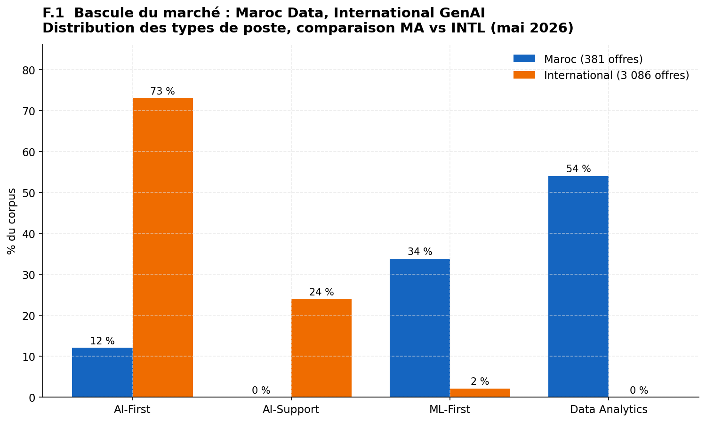

La figure 3.1 met en évidence un saut quantitatif observable dès le premier trimestre 2023 sur les compétences typiques de l'Intelligence Artificielle générative, en particulier les modèles de langage, les architectures de génération augmentée par récupération (Retrieval-Augmented Generation, ou RAG) et l'ingénierie de prompts. Ce constat empirique valide l'hypothèse retenue par le projet, à savoir que la période 2023 à 2026 constitue une fenêtre d'observation pertinente pour mesurer la diffusion des compétences en Intelligence Artificielle générative dans les annonces d'emploi.

## 3.2 Volumes et distribution

### 3.2.1 Distribution par origine et par source

Le corpus consolidé regroupe 3 467 fiches d'offres après canonicalisation et déduplication. Il se décompose en 381 fiches collectées au Maroc et 3 086 fiches collectées à l'international. La distribution par source est présentée dans le tableau 3.1.

| Origine | Source | Postings | Période de publication | Méthode de collecte |
|---|---|---:|---|---|
| Maroc | ANAPEC | 2 | 2026-05 | Playwright |
| Maroc | Rekrute | 27 | 2023-2026 | Playwright |
| Maroc | Indeed MA | 67 | 2025-2026 | Apify + recovery |
| Maroc | LinkedIn MA | 207 | 2025-2026 | Apify (LinkedIn scraper) |
| Maroc | Pages carrières MA | 6 | 2026-05 | Firecrawl + JSON-LD |
| Maroc | Glassdoor MA | 72 | 2025-2026 | Firecrawl + recovery |
| International | Corpus Tech INTL (builtin.com, 6 pays) | 3 086 | 2025-08 à 2026-04 | Pipeline 5 étapes (import upstream) |
| **Total** | | **3 467** | **2022-08 à 2026-05** | |

**Tableau 3.1 :** Distribution des 3 467 fiches consolidées par origine et par source.

Le marché marocain est représenté par six sources distinctes couvrant 27 mois et 147 entreprises distinctes. Le marché international est représenté par une source unique (le corpus Tech INTL importé depuis `builtin.com` selon le protocole décrit en section 2.1), couvrant 6 mois sur 1 378 entreprises distinctes réparties sur six pays (États-Unis, Inde, Royaume-Uni, Allemagne, Pays-Bas, et International générique). Cette asymétrie de volumétrie entre les deux sous-corpus est commentée et discutée comme limite de l'étude en section 5.2.1.

### 3.2.2 Profils de poste accessoires

Au-delà des intitulés principaux, le corpus présente deux indicateurs accessoires utiles à la caractérisation des marchés. Au Maroc, 22 fiches (5,8 %) correspondent à des postes managériaux et 81 fiches (21,3 %) à des postes à interface client. À l'international, ces proportions s'élèvent respectivement à 14,9 % (459 fiches) et 22,4 % (692 fiches). L'écart de représentation des postes managériaux entre les deux marchés traduit la maturité organisationnelle plus élevée des structures internationales, qui disposent d'équipes d'Intelligence Artificielle suffisamment dimensionnées pour justifier des fonctions d'encadrement spécialisées.

## 3.3 Distribution par type de poste : Maroc et International

La classification automatique en quatre catégories de postes (AI-First, AI-Support, ML-First, Data Analytics), réalisée au moment de la collecte par le modèle Claude Sonnet 4.5 à partir du titre, des responsabilités et des compétences requises, révèle un contraste majeur entre les deux marchés.

| Type de poste | Maroc | International | Écart (INTL moins MA) |
|---|---:|---:|---:|
| AI-First | 12,1 % | 73,1 % | +61,0 points |
| AI-Support | 0,0 % | 24,0 % | +24,0 points |
| ML-First | 33,9 % | 2,1 % | -31,8 points |
| Data Analytics | 54,1 % | 0,0 % | -54,1 points |
| Inconnu | 0,0 % | 0,7 % | +0,7 point |

**Tableau 3.2 :** Distribution des types de poste dans les corpus Maroc et International.

Ce tableau livre l'un des résultats les plus structurants du projet. Le marché international, observé depuis `builtin.com` sur les six derniers mois, est massivement orienté vers des profils AI-First (73,1 %), c'est-à-dire vers des postes où l'Intelligence Artificielle générative constitue le produit lui-même. Le marché marocain, à l'inverse, reste dominé par des profils Data Analytics (54,1 %) et Machine Learning traditionnel (33,9 %), avec une présence très limitée de profils AI-First (12,1 %) et une absence totale de profils AI-Support. Ce constat empirique fonde la pertinence du volet de gap analysis présenté au chapitre 5.1, lequel mesure dans quelle mesure les filières des Écoles Nationales des Sciences Appliquées du Maroc préparent à un marché national dont la composition diffère sensiblement du marché international de référence.

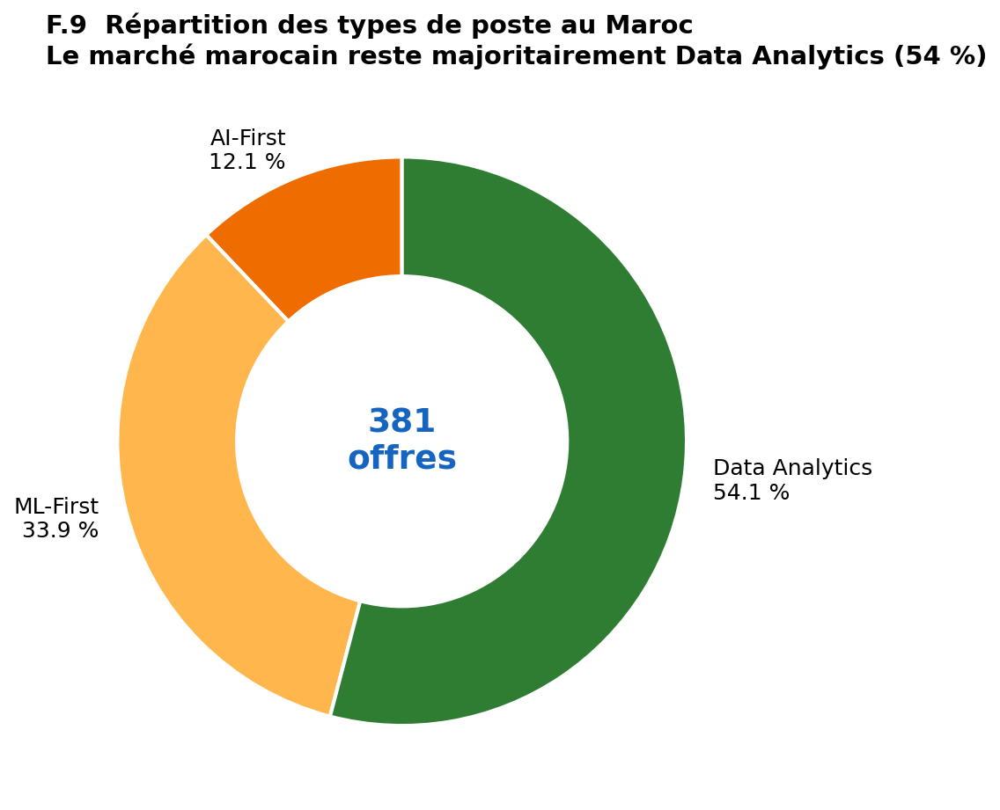

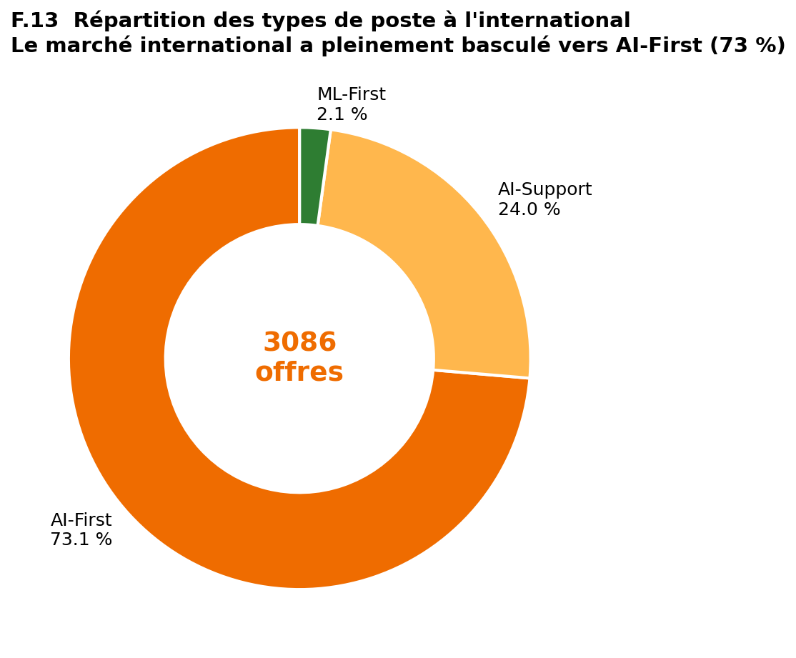

## 3.4 Top employeurs et top intitulés de poste

### 3.4.1 Top employeurs au Maroc

Le top 15 des employeurs marocains, présenté sur la figure 3.4, est dominé par des cabinets de conseil internationaux et leurs filiales locales (Capgemini avec 20 offres, ALTEN avec 18 offres complétées par 9 offres d'ALTEN Maroc, Devoteam avec 6 offres, SQLI avec 7 offres). Le secteur bancaire marocain est représenté par CIH Bank (14 offres), BNP Paribas (7 offres) et Société Générale (5 offres). Le portail BROME Consulting and Technology arrive en tête avec 23 offres, suivi de la plateforme de voyage Agoda qui maintient un centre Data à Casablanca avec 12 offres. La catégorie « Unknown », troisième position avec 13 offres, regroupe les annonces dont l'entité morale n'a pas pu être identifiée de manière fiable au moment de la collecte.

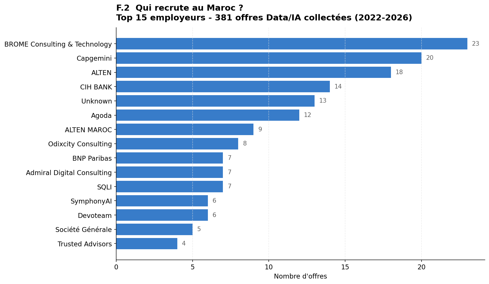

### 3.4.2 Top employeurs à l'international

Le top 20 international, présenté sur la figure 3.5, fait apparaître une domination des grands acteurs des services financiers américains (Capital One avec 56 offres, Citi avec 39 offres, Wells Fargo et BlackRock avec 20 et 18 offres, GEICO avec 12 offres), des laboratoires d'Intelligence Artificielle natifs (NVIDIA avec 24 offres, OpenAI avec 16 offres, Scale AI avec 14 offres) et des plateformes d'édition et de conseil spécialisées (Thomson Reuters, Wolters Kluwer, S and P Global, Optum). La présence de la start-up Jack and Jill AI en troisième position (37 offres) illustre la dynamique des structures de taille intermédiaire dédiées à l'Intelligence Artificielle générative.

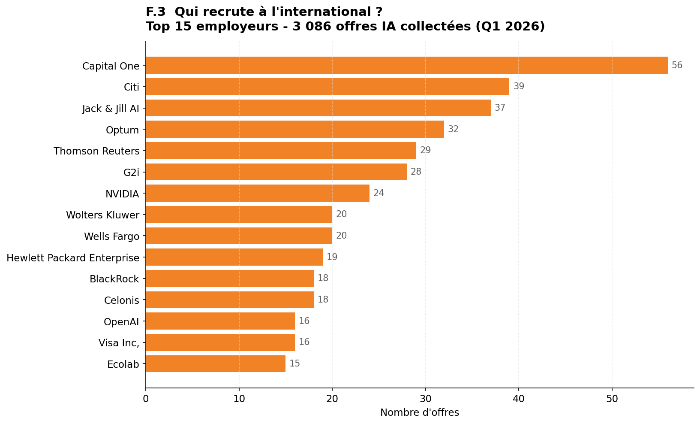

### 3.4.3 Top intitulés de poste au Maroc

La figure 3.6 présente le top 10 des intitulés de poste au Maroc après canonicalisation. La hiérarchie est dominée par les trois intitulés classiques du domaine, à savoir Data Analyst (37 offres), Data Scientist (30 offres) et Data Engineer (23 offres). Les intitulés spécifiques à l'Intelligence Artificielle générative apparaissent à des fréquences faibles : 4 offres pour AI Engineer, 4 offres pour BI Analyst et seulement 3 offres pour des intitulés hybrides du type AI Machine Learning Optimization Engineer.

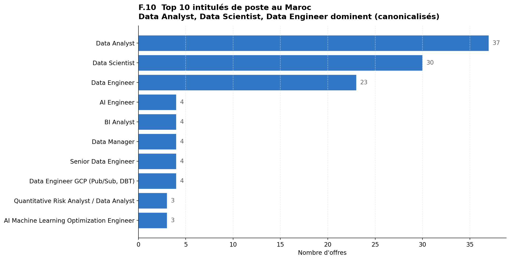

### 3.4.4 Top intitulés de poste à l'international

À l'international, le top 10 présenté sur la figure 3.7 confirme la prépondérance des profils AI-First. L'intitulé AI Engineer concentre 148 offres et ses déclinaisons hiérarchiques (Senior AI Engineer 98, Lead AI Engineer 29, Staff AI Engineer 27, Principal AI Engineer 22) traduisent l'existence de filières d'évolution complètes au sein des entreprises. L'intitulé Applied AI Engineer (45 offres) caractérise un profil intermédiaire dédié à la mise en production de solutions construites sur des modèles de fondation existants. L'absence d'intitulés de type Data Analyst dans le top 10 international tranche avec la composition observée au Maroc.

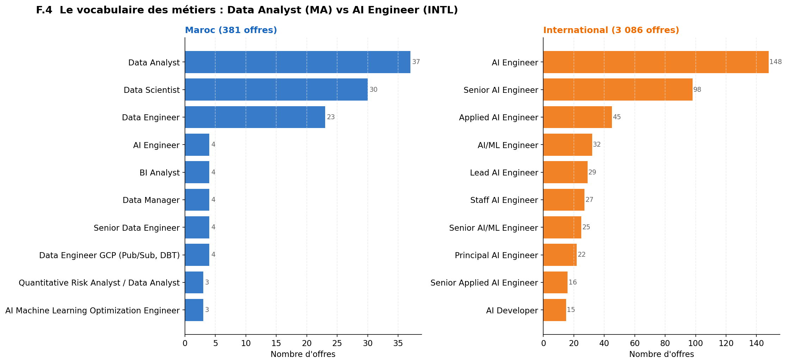

## 3.5 Compétences par famille

L'analyse des compétences est conduite sur les dix familles définies par la taxonomie SKILLNAV (Intelligence Artificielle générative, Machine Learning, Bases de données, Data Engineering, Cloud, Operations et MLOps, Langages de programmation, Frameworks web et APIs, Domaines métier, Autres outils). Le détail de la taxonomie est documenté dans le module `skillnav/pipelines/structure_mining/graph_builder.py` et reproduit en annexe A.

### 3.5.1 Compétences dominantes au Maroc

La figure 3.8 et le détail par famille présenté sur la figure 3.9 mettent en évidence un profil caractéristique du marché marocain. Le langage Python (52,8 % du corpus marocain) et la maîtrise de SQL (57,2 %) y constituent les deux compétences les plus universellement demandées. Les outils de Business Intelligence occupent une place significative, avec Power BI à 27,6 %, Tableau à 15,7 % et Excel à 10,8 %. Le Machine Learning classique représenté par scikit-learn (6,6 %), TensorFlow (9,4 %), PyTorch (9,2 %) et Deep Learning (7,6 %) confirme la maturité du marché sur les techniques antérieures à la vague Intelligence Artificielle générative. À l'inverse, les compétences caractéristiques de l'Intelligence Artificielle générative apparaissent à des fréquences très faibles : Large Language Model à 6,0 %, GenAI à 5,0 %, RAG à 2,9 %, LangChain à 1,0 %.

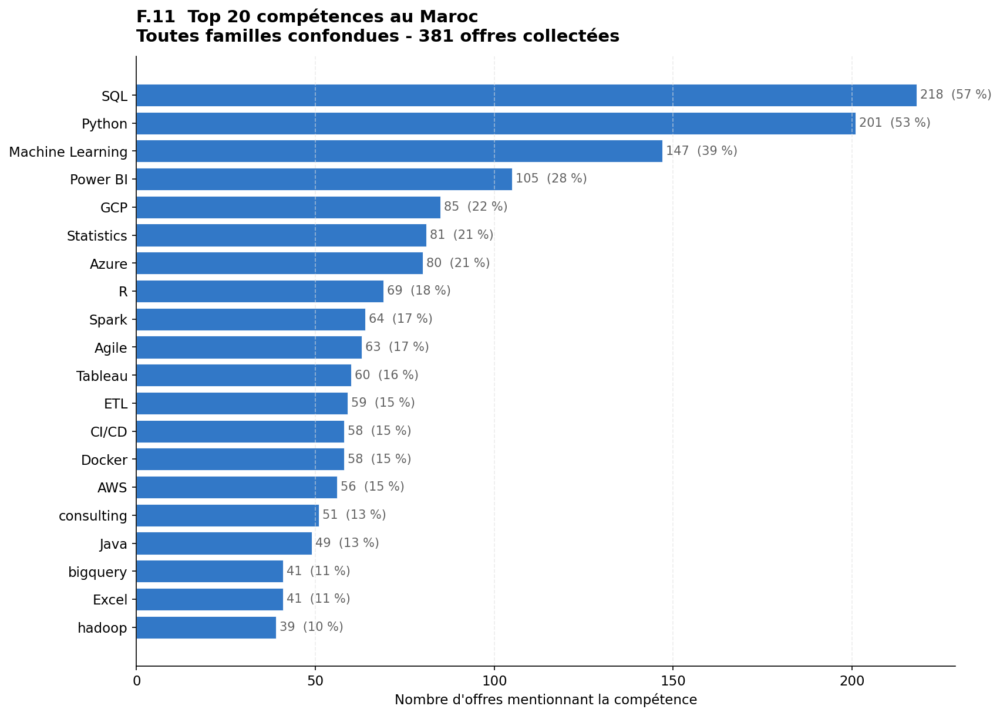

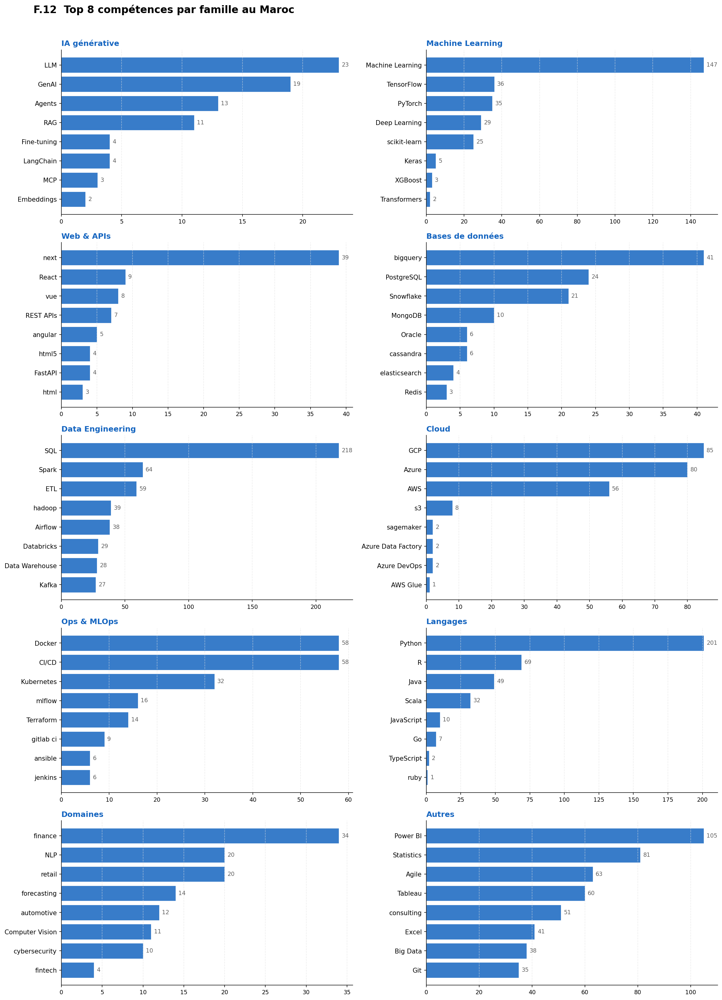

### 3.5.2 Compétences dominantes à l'international

La figure 3.10 et le détail par famille présenté sur la figure 3.11 dressent un portrait diamétralement opposé. Le langage Python s'impose comme une compétence quasi universelle (83,4 % du corpus international). Les compétences caractéristiques de l'Intelligence Artificielle générative dominent les fréquences : Prompt Engineering à 37,2 %, RAG à 34,1 %, LangChain à 23,4 %, Agents à 22,6 %, Large Language Model à 22,6 %. La cloud computing fait apparaître une avance nette d'Amazon Web Services (40,6 %) sur Microsoft Azure (28,0 %) et Google Cloud Platform (27,4 %). Les pratiques d'industrialisation y sont fortement représentées avec Docker (35,0 %), CI / CD (33,7 %) et Kubernetes (28,5 %).

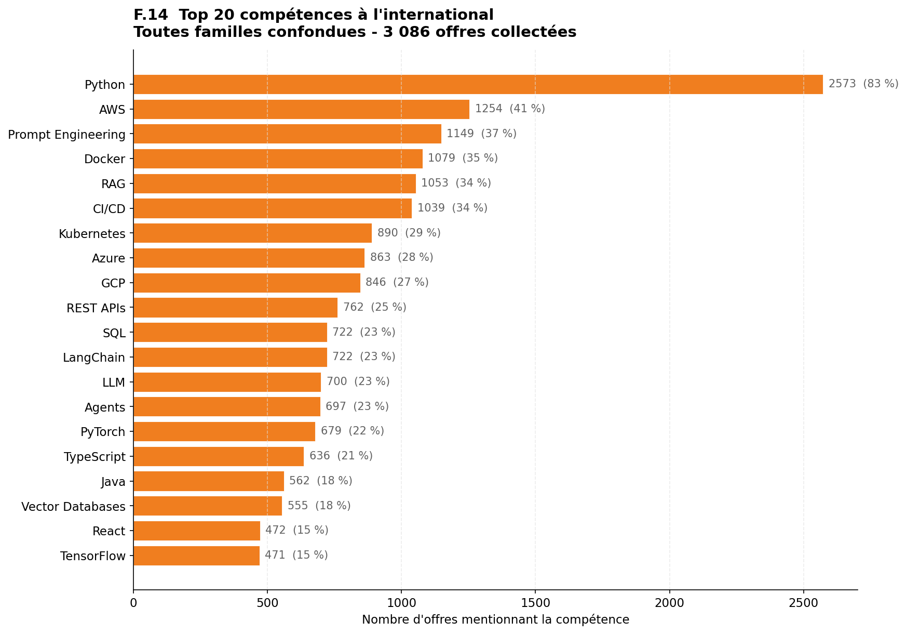

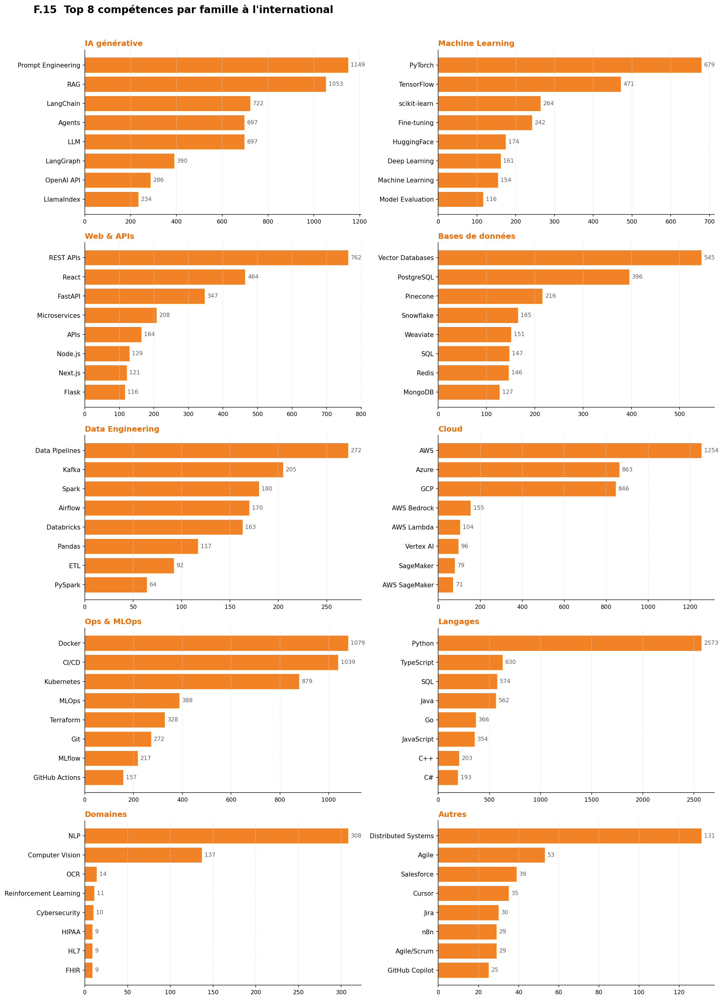

## 3.6 Écosystème des frameworks d'Intelligence Artificielle générative

L'examen ciblé des frameworks d'orchestration d'Intelligence Artificielle générative révèle un écart de maturité considérable entre les deux marchés. Au Maroc, seuls LangChain (4 offres, 1,0 %) et LlamaIndex (1 offre, 0,3 %) sont mentionnés explicitement. À l'international, l'écosystème est nettement plus diversifié et plus largement adopté, comme illustré par la figure 3.12 : LangChain est cité dans 722 offres (23,4 %), LangGraph dans 390 offres (12,6 %), LlamaIndex dans 234 offres (7,6 %), CrewAI dans 184 offres (6,0 %), AutoGen dans 129 offres (4,2 %), Semantic Kernel dans 73 offres (2,4 %) et Haystack dans 24 offres (0,8 %).

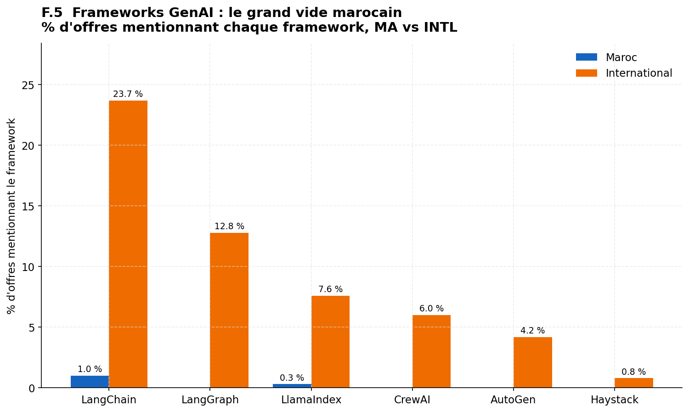

L'écart est particulièrement saillant pour les frameworks d'orchestration d'agents conversationnels (CrewAI, AutoGen, LangGraph) qui n'apparaissent dans aucune offre marocaine du corpus. Ce constat éclaire l'analyse comparative de la section 3.10 et constitue l'une des fondations empiriques de la discussion menée au chapitre 5.

## 3.7 Grand écart de compétences entre marché international et marché marocain

L'analyse des dix compétences les plus sur-représentées à l'international par rapport au Maroc, présentée sur la figure 3.13, confirme et quantifie l'écart structurel entre les deux marchés. L'écart le plus marqué concerne Large Language Model, qui apparaît dans 54,2 % des offres internationales contre seulement 6,3 % des offres marocaines, soit un écart de 47,9 points de pourcentage. Suivent RAG (43,5 % contre 2,9 %, écart de 40,6 points), Prompt Engineering (37,6 % contre 0,5 %, écart de 37,1 points), Amazon Web Services (46,5 % contre 14,7 %, écart de 31,8 points) et le langage Python lui-même (83,4 % contre 52,8 %, écart de 30,6 points).

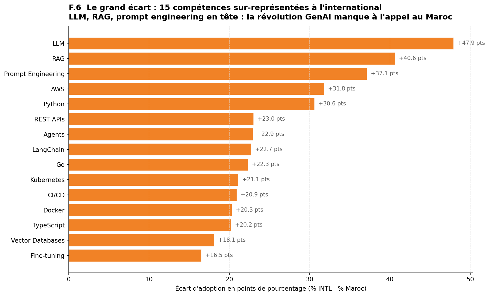

Ces écarts considérables, mesurés en points de pourcentage, dessinent un retard d'adoption du Maroc sur les compétences caractéristiques de la vague Intelligence Artificielle générative. La compréhension fine de l'origine de ces écarts (effet de structure des employeurs, effet temporel de diffusion, effet de maturité organisationnelle) dépasse le périmètre de la présente étude descriptive, mais l'observation empirique elle-même est solidement établie.

## 3.8 Compétences typiques du marché marocain

L'analyse symétrique des compétences sur-représentées au Maroc par rapport à l'international, présentée sur la figure 3.14, livre un portrait cohérent du marché national. La compétence la plus sur-représentée au Maroc est SQL (59,1 % contre 35,3 % à l'international, écart de 23,8 points). Suivent les outils de Data Engineering classique : Spark (19,2 % contre 7,5 %, écart de 11,7 points), Airflow (10,0 % contre 5,9 %, écart de 4,1 points), Databricks (7,6 % contre 6,7 %, écart faible mais positif). Les outils Microsoft sont également mieux représentés au Maroc, Power BI atteignant 27,6 % du corpus marocain contre 0,8 % à l'international.

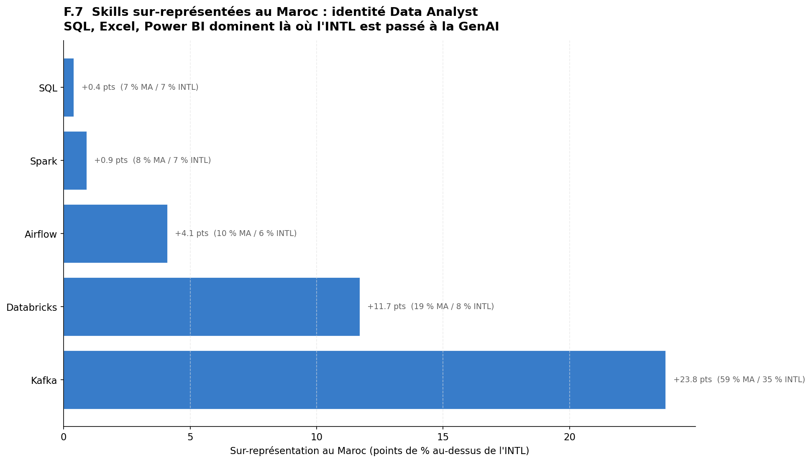

Ce portrait permet de caractériser le marché marocain comme un marché orienté Data Analytics traditionnel et Data Engineering, dans lequel les compétences SQL, les outils de Business Intelligence Microsoft et les frameworks Big Data classiques (Spark, Airflow, Databricks) prédominent. Cette configuration est cohérente avec la composition par type de poste observée en section 3.3, où les profils Data Analytics représentent la majorité absolue du marché.

## 3.9 Profils recherche et profils application ou production

L'orientation scientifique des profils est estimée à partir d'une heuristique de pondération de mots-clés appliquée au titre et à la description des offres, telle qu'implémentée dans le module `scripts/skillnav_eda.py`. Au Maroc, 70 fiches (18,4 %) sont classées comme orientées recherche tandis que 311 fiches (81,6 %) sont classées comme orientées application ou production. À l'international, l'écart est plus prononcé : 94 fiches seulement (3,0 %) sont classées comme orientées recherche, contre 2 992 fiches (97,0 %) orientées application ou production.

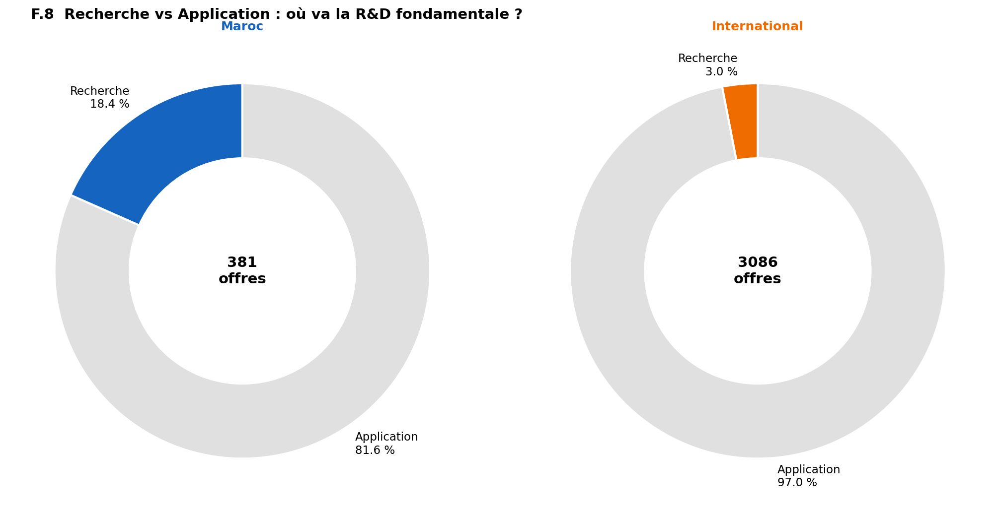

La quasi-absence de profils dédiés à la recherche dans le corpus international s'explique par la spécialisation de la source `builtin.com`, dont le périmètre éditorial concerne essentiellement le marché de l'emploi tech industriel et non les laboratoires académiques ou les centres de recherche. Cette particularité de la source est commentée comme biais reconnu en section 2.6.3 et reprise dans les limites de l'étude en section 5.2.

## 3.10 Comparaison ciblée des vingt premières compétences

La comparaison directe des vingt premières compétences entre les deux corpus, présentée sur la figure 3.16, synthétise les constats des sections précédentes. Trois groupes de compétences se dégagent.

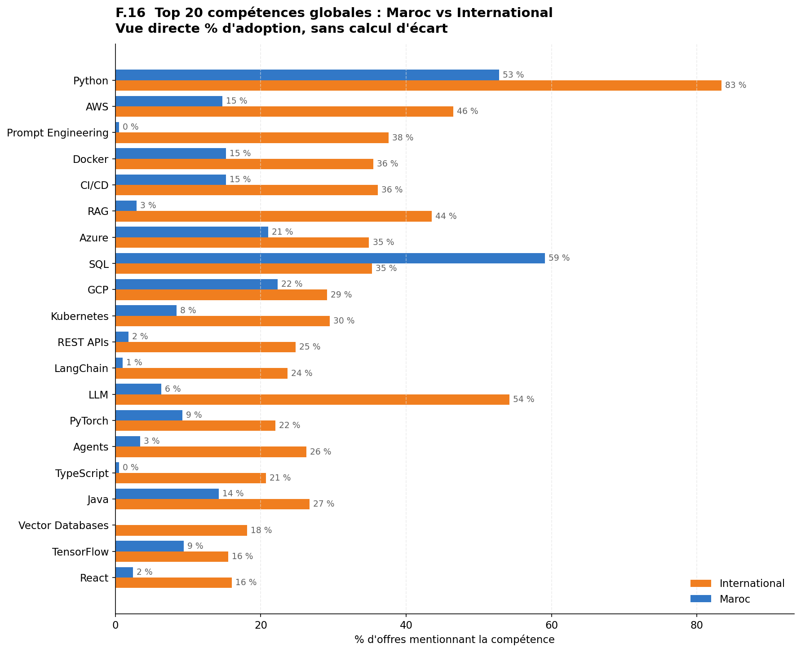

Le premier groupe rassemble les compétences universelles, présentes des deux côtés à des fréquences élevées, telles que Python (52,8 % au Maroc contre 83,4 % à l'international) ou SQL (59,1 % contre 35,3 %). Le second groupe rassemble les compétences caractéristiques de l'Intelligence Artificielle générative, fortement présentes à l'international et marginales au Maroc, telles que Large Language Model, RAG, Prompt Engineering, LangChain, Agents et Vector Databases. Le troisième groupe rassemble les compétences spécifiques au Data Engineering classique, légèrement plus représentées au Maroc et stables à l'international, telles que Spark, Airflow et Snowflake. Cette structuration tripartite éclaire les analyses comparatives algorithmiques du chapitre 4 et nourrit la discussion du gap analysis au chapitre 5.

## 3.11 Synthèse du portrait du marché observé

Les douze analyses descriptives présentées dans ce chapitre convergent vers un portrait nuancé du marché des compétences en Intelligence Artificielle et Data Science observé entre 2022 et 2026.

À l'international, et au regard du corpus de 3 086 offres collectées sur six pays via `builtin.com`, le marché est dominé par des profils AI-First (73,1 %), construit autour d'un écosystème mature d'Intelligence Artificielle générative (Large Language Model, RAG, agents, LangChain, vector databases), structuré par des pratiques d'industrialisation cloud (AWS, Docker, Kubernetes, CI / CD) et orienté quasi exclusivement vers la production (97,0 %). Cette configuration traduit l'achèvement, au moins partiel, de la bascule vers l'Intelligence Artificielle générative déclenchée par la sortie de ChatGPT en novembre 2022.

Au Maroc, et au regard des 381 offres collectées sur 27 mois et six sources, le marché présente une physionomie sensiblement différente. Les profils Data Analytics (54,1 %) et Machine Learning traditionnel (33,9 %) y dominent, tandis que les profils AI-First restent minoritaires (12,1 %) et les profils AI-Support inexistants. La stack technique observée est centrée sur SQL, Python, Power BI et les outils de Data Engineering classiques, et la pénétration des frameworks d'Intelligence Artificielle générative est marginale (LangChain à 1,0 %, RAG à 2,9 %, Large Language Model à 6,0 %).

Ces deux portraits ne doivent pas être lus comme l'expression d'un retard absolu, dans la mesure où la différence de volumétrie et la spécialisation tech industrielle de la source internationale constituent des biais discutés en section 5.2. Ils dessinent néanmoins un décalage empiriquement mesurable, dont l'ampleur (écart de 47,9 points sur Large Language Model, 40,6 points sur RAG, 37,1 points sur Prompt Engineering) suffit à motiver les analyses de structure et d'évolution conduites dans les chapitres suivants. Le chapitre 4 examine quelles techniques permettent d'extraire, d'organiser et d'anticiper les compétences observées. Le chapitre 5 met en regard les compétences enseignées par les Écoles Nationales des Sciences Appliquées marocaines et les compétences effectivement demandées par le marché, en s'appuyant sur les écarts caractérisés dans le présent chapitre.

---

# Chapitre 4 - Études comparatives et choix justifiés

Le présent chapitre constitue le cœur scientifique du rapport. Il rapporte les résultats des trois études comparatives algorithmiques menées dans le cadre du projet SKILLNAV, conformément à l'exigence du sujet imposé pour le module M242 selon laquelle chaque tâche du pipeline doit faire l'objet d'une comparaison entre au moins trois algorithmes distincts. La

## 4.1 Protocole expérimental commun

Les trois études partagent un ensemble de principes méthodologiques destinés à garantir la reproductibilité et la comparabilité des résultats. Les versions des bibliothèques Python utilisées sont épinglées dans le fichier `poetry.lock` à la racine du projet, ce qui assure qu'une exécution future du pipeline aboutira à des chiffres identiques au million près. Les graines aléatoires des algorithmes non déterministes sont fixées explicitement (`seed=42` pour Label Propagation, `random_state=42` pour la sélection du gold set NER). Les exécutions multiples sont systématiquement utilisées lorsqu'un algorithme présente une variance d'exécution non négligeable, comme c'est le cas de Label Propagation dont la stabilité est mesurée sur cinq exécutions avec des graines différentes. Les métriques utilisées sont sélectionnées en fonction des spécificités de chaque tâche : score F1 macro pour le NER, modularité Q de Newman (2006) pour les communautés, racine carrée de l'erreur quadratique moyenne (RMSE) pour le forecasting. Le détail méthodologique de chaque étude est exposé en ouverture de sa section dédiée.

## 4.2 Reconnaissance d'entités nommées : étude §N2.1

### 4.2.1 Modèles comparés

Trois modèles transformer ont été retenus pour la comparaison, chacun représentant une option stratégique distincte sur l'arbre de décision du projet. Le modèle BERT multilingue (`Davlan/bert-base-multilingual-cased-ner-hrl`, 110 millions de paramètres) représente l'option universelle, capable de traiter un corpus mixte français et anglais sans changement de modèle. Le modèle CamemBERT-NER (`Jean-Baptiste/camembert-ner`, 110 millions de paramètres) représente l'option optimisée pour le marché marocain, dont les offres sont majoritairement rédigées en français. Le modèle DistilBERT-NER (`dslim/distilbert-NER`, 66 millions de paramètres) représente l'option légère et rapide pour le marché international, dont le corpus collecté est essentiellement anglophone. Les trois modèles sont hébergés sur Hugging Face Hub et accessibles sans authentification, avec des licences compatibles avec un usage académique.

### 4.2.2 Protocole d'évaluation

L'évaluation repose sur un gold set de 30 fiches sélectionnées de manière diversifiée (8 fiches Maroc et 22 fiches International, couvrant les quatre types de poste AI-First, AI-Support, ML-First et Data Analytics). La stratégie d'annotation retenue est celle de la *distant supervision* documentée par Hovy et al. (2014), qui consiste à utiliser comme référence les compétences extraites et canonicalisées par le pipeline structuré établi pendant la phase de collecte. Ce choix méthodologique est imposé par la contrainte temporelle du projet : l'annotation manuelle de 30 fiches par un binôme représenterait 6 à 10 heures de travail, incompatibles avec le calendrier des sprints. Les limites de cette stratégie (propagation des biais de canonicalisation, sur-évaluation possible du rappel par matching en sous-chaîne) sont reprises au chapitre 5.2.2. Le matching entre entités prédites et compétences gold s'opère par sous-chaîne en mode insensible à la casse, et les trois métriques retenues sont la précision, le rappel et le score F1.

### 4.2.3 Résultats chiffrés

Les résultats obtenus sur le gold set sont synthétisés dans le tableau 4.1.

| Modèle | Paramètres | Précision | Rappel | F1 | Temps moyen (s/fiche) | Entités prédites | Skills gold détectés |
|---|---:|---:|---:|---:|---:|---:|---|
| BERT multilingue | 110 M | 0,308 | 0,029 | **0,054** | 0,29 | 49 | 16 sur 543 |
| CamemBERT-NER | 110 M | 0,454 | 0,282 | **0,348** | 0,38 | 310 | 153 sur 543 |
| **DistilBERT-NER** | 66 M | 0,443 | 0,484 | **0,463** | **0,15** | 532 | 263 sur 543 |

**Tableau 4.1 :** Étude comparative §N2.1 des trois modèles NER évalués sur le gold set de 30 fiches.

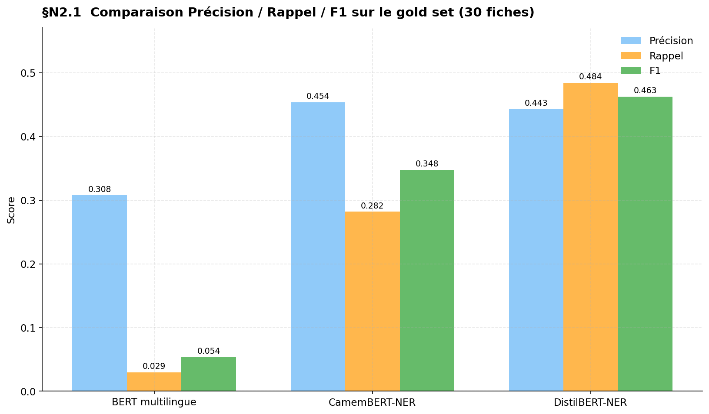

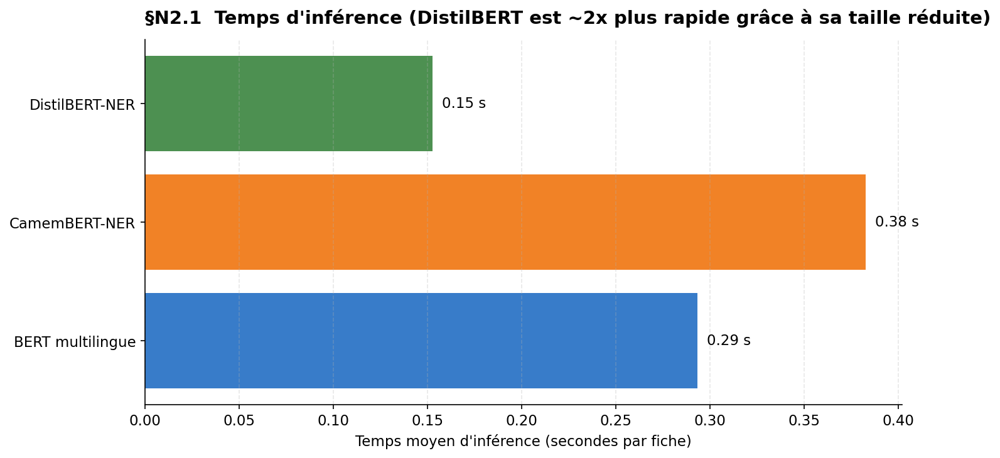

### 4.2.4 Discussion

Trois enseignements ressortent de cette comparaison.

D'abord, BERT multilingue est inexploitable : son rappel de 0,029 traduit une quasi-absence de détection sur les textes techniques mixtes français-anglais du corpus, le modèle ayant été pré-entraîné sur un corpus généraliste couvrant dix langues. Sa précision honorable (0,308) ne compense pas l'identification de moins de deux entités par fiche en moyenne.

Ensuite, CamemBERT-NER affiche des résultats équilibrés (précision 0,454 ; rappel 0,282 ; F1 0,348), cohérents avec sa spécialisation française. Sa limite tient au corpus lui-même : 73 % des offres sont rédigées en anglais, donc hors de son périmètre d'entraînement.

Enfin, DistilBERT-NER s'impose avec le meilleur F1 (0,463), porté par un rappel élevé (0,484). Le modèle atteint ce résultat avec 40 % de paramètres en moins (66 M contre 110 M) et un temps d'inférence divisé par deux (0,15 seconde par fiche).

### 4.2.5 Itération zero-shot avec GLiNER

Au-delà de la comparaison principale des trois modèles transformer classiques, une itération complémentaire a été menée avec le modèle GLiNER (Generalist Lightweight Named Entity Recognition) en mode zero-shot, c'est-à-dire sans étape de fine-tuning préalable. Cette itération exploite la capacité de GLiNER à recevoir une liste d'étiquettes cibles au moment de l'inférence, ce qui permet d'orienter l'extraction vers les types d'entités effectivement présents dans le corpus SKILLNAV (SKILL, TOOL, FRAMEWORK, MODEL, LANGUAGE, ROLE). L'effet du seuil d'abstention sur la performance globale est étudié dans la figure 4.3, et la synthèse comparative complète figure 4.4 met en regard les performances de GLiNER avec celles des trois modèles classiques de la comparaison principale.

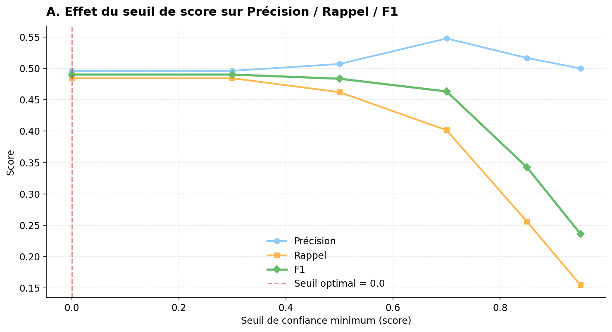

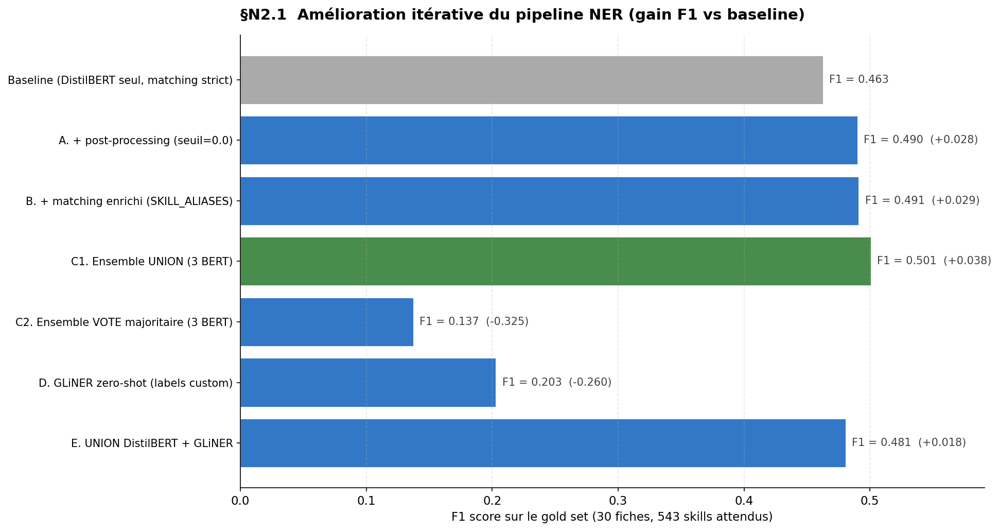

### 4.2.6 Choix retenu et perspectives

Le modèle DistilBERT-NER est retenu pour le pipeline de production de la version V1 de SKILLNAV. Trois critères justifient ce choix. Le score F1 obtenu sur le gold set (0,463) est le plus élevé des trois modèles comparés. Le temps d'inférence par fiche (0,15 seconde) est le plus court, ce qui correspond à un temps total inférieur à neuf minutes pour le traitement complet des 3 467 fiches du corpus en cas de mise à jour. L'empreinte mémoire est 40 % plus faible que celle des deux autres modèles, ce qui rend le modèle déployable sur les services cloud gratuits envisagés pour le dashboard SKILLNAV. Plusieurs pistes d'amélioration sont identifiées et reportées au chapitre 5.4 comme perspectives V1.5 : le fine-tuning de DistilBERT sur un gold set étendu à 100 ou 200 fiches annotées manuellement (gain F1 attendu entre 0,15 et 0,25 selon Lample et al., 2016), la mise en place d'un ensemble combinant DistilBERT (rappel) et CamemBERT (précision sur les fiches en français), et l'évaluation de modèles plus récents tels que `mDeBERTa-NER` ou la version fine-tunée de GLiNER.

## 4.3 Détection de communautés dans le graphe de compétences : étude §N2.2

### 4.3.1 Protocole expérimental

L'étude porte sur le graphe Skill vers Skill construit par projection de co-occurrence à partir des 3 468 offres du corpus, dont la méthodologie est exposée en section 2.4. Le graphe comporte 3 937 nœuds représentant les compétences canoniques, et 10 324 arêtes pondérées par le nombre d'offres dans lesquelles les deux compétences co-occurrent. Le seuil minimum de co-occurrence est fixé à 2, ce qui écarte les paires fortuites observées dans une seule offre exotique. Trois caractéristiques importantes du graphe sont à noter avant la lecture des résultats. Sa densité est très faible (0,0013), ce qui est attendu sur un graphe technique de cette taille où chaque compétence n'est connectée qu'à une fraction très restreinte de l'ensemble des autres compétences. Le graphe comporte 2 768 composantes connexes, ce qui signifie que la majorité des nœuds sont des îlots isolés correspondant à des compétences rares ou très spécialisées qui ne co-occurrent qu'avec une ou deux autres compétences sans pont vers le graphe principal. Le degré moyen est de 5,24, mais cette moyenne masque une distribution très inégale dans laquelle les compétences universelles (Python, SQL) sont connectées à plus de deux cents autres compétences alors que les compétences spécialisées ne le sont qu'à quelques-unes.

Trois algorithmes de détection de communautés sont comparés sur ce graphe : Louvain (Blondel et al., 2008) dans son implémentation `python-louvain`, Leiden (Traag et al., 2019) dans son implémentation `igraph`, et Label Propagation (Raghavan et al., 2007) dans son implémentation `networkx`. La métrique de qualité retenue est la modularité Q définie par Newman (2006), dont la valeur s'étale entre -1 et 1 et qui mesure la densité des arêtes intra-communautés relativement à un graphe aléatoire de même distribution de degrés.

### 4.3.2 Résultats chiffrés

Les résultats obtenus sur le graphe complet sont synthétisés dans le tableau 4.2.

| Algorithme | Modularité Q | Nombre de communautés | Temps (s) | Notes interprétatives |
|---|---:|---:|---:|---|
| Louvain | 0,2943 | 2 782 | 1,101 | Méthode itérative classique, référence du rapport |
| **Leiden** | **0,2988** | 2 784 | 0,383 | Amélioration de Louvain, modularité maximale et connexité garantie |
| Label Propagation | 0,1476 | 2 784 | 0,498 | Très rapide mais non déterministe, fragmentation importante |

**Tableau 4.2 :** Étude comparative §N2.2 des trois algorithmes de détection de communautés sur le graphe Skill vers Skill.

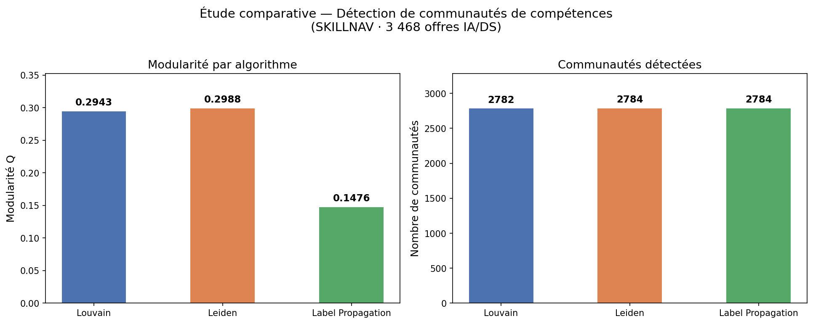

Le nombre élevé de communautés (entre 2 782 et 2 784 selon l'algorithme) s'explique directement par la présence des 2 768 composantes connexes du graphe : chaque composante isolée constitue par construction sa propre communauté triviale. La structure communautaire pertinente, c'est-à-dire celle qui apporte une information sémantique exploitable, se concentre dans le sous-graphe principal connecté, dont l'analyse qualitative est conduite en section 4.3.4.

### 4.3.3 Stabilité de l'algorithme Label Propagation

L'algorithme Label Propagation est par construction non déterministe, dans la mesure où il s'appuie sur une initialisation aléatoire des étiquettes des nœuds et sur un ordre de traitement variable. Sa stabilité est mesurée en exécutant cinq fois l'algorithme sur le même graphe avec cinq graines aléatoires différentes. Les résultats sont synthétisés dans le tableau 4.3.

| Graine | Modularité Q | Nombre de communautés |
|---:|---:|---:|
| 0 | 0,1486 | 2 786 |
| 1 | 0,1486 | 2 784 |
| 2 | 0,1494 | 2 785 |
| 3 | 0,1484 | 2 785 |
| 4 | 0,1485 | 2 785 |

**Tableau 4.3 :** Stabilité de Label Propagation sur cinq exécutions avec graines aléatoires différentes. Moyenne Q égale à 0,1487, écart-type égal à 0,0004.

La variance observée est très faible (écart-type de 0,0004 sur Q, écart-type de 0,89 sur le nombre de communautés). Cette stabilité empirique inattendue s'explique par la structure particulière du graphe SKILLNAV, dominée par des composantes isolées. Les algorithmes Louvain et Leiden sont déterministes par construction, avec un écart-type strictement nul.

### 4.3.4 Centralité des compétences par PageRank

Au-delà de la partition en communautés, l'analyse de la centralité de chaque compétence par l'algorithme PageRank (Page et al., 1999), exécuté avec un facteur d'amortissement alpha égal à 0,85, fournit un classement des compétences les plus structurantes du marché. Une compétence obtient un score PageRank élevé lorsqu'elle co-occurre avec d'autres compétences elles-mêmes très connectées. Le top 20 des compétences pivot est reproduit dans la figure 4.6 et synthétisé dans le tableau 4.4.

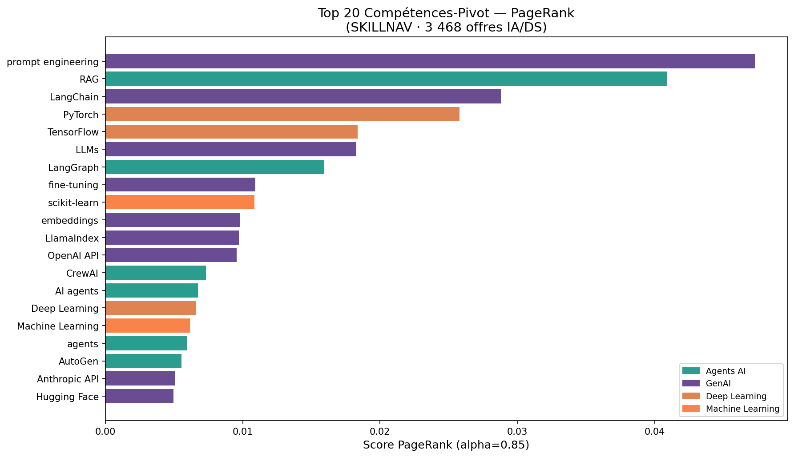

| Rang | Compétence | Score PageRank | Famille |
|---:|---|---:|---|
| 1 | prompt engineering | 0,0473 | GenAI |
| 2 | RAG | 0,0409 | Agents AI |
| 3 | LangChain | 0,0288 | GenAI |
| 4 | PyTorch | 0,0258 | Deep Learning |
| 5 | TensorFlow | 0,0184 | Deep Learning |
| 6 | LLMs | 0,0183 | GenAI |
| 7 | LangGraph | 0,0159 | Agents AI |
| 8 | fine-tuning | 0,0109 | GenAI |
| 9 | scikit-learn | 0,0109 | Machine Learning |
| 10 | embeddings | 0,0098 | GenAI |

**Tableau 4.4 :** Top 10 des compétences les plus centrales selon le PageRank (extrait du top 20 complet).

Sept des dix premières compétences pivot appartiennent à l'écosystème de l'Intelligence Artificielle générative ou des agents conversationnels. Le constat empirique est sans ambiguïté : à l'horizon mai 2026, les compétences structurantes du marché des emplois en Intelligence Artificielle sont massivement issues de la vague Generative AI déclenchée par la sortie publique de ChatGPT en novembre 2022. Les compétences classiques du Machine Learning (PyTorch, TensorFlow, scikit-learn) restent présentes dans le top 10 mais cèdent leur position de tête aux compétences génératives.

### 4.3.5 Analyse qualitative des cinq plus grandes communautés Louvain

L'inspection des cinq plus grandes communautés détectées par Louvain dans le sous-graphe principal connecté révèle une structuration sémantique cohérente. La première communauté, comportant 542 compétences, est centrée sur l'Intelligence Artificielle générative et les agents conversationnels, avec en tête prompt engineering, RAG, LangChain, LLMs et LangGraph. La deuxième communauté, comportant 291 compétences, regroupe les compétences classiques du Deep Learning autour de PyTorch, TensorFlow, scikit-learn et Keras. La troisième communauté, comportant 146 compétences, est inattendue et regroupe les environnements de développement assistés par Intelligence Artificielle générative (Cursor, GitHub Copilot, Claude Code, Gemini, n8n) ainsi que les outils d'orchestration SaaS du quotidien (Salesforce, Jira, ServiceNow). La quatrième communauté, comportant 83 compétences, regroupe les compétences classiques du Data Analytics et de l'analyse de données (Machine Learning, Python, SQL, GCP, Power BI, R, Statistics, Azure, Spark, Tableau), correspondant à la stack typique du marché marocain identifiée en section 3.5.1. La cinquième communauté, comportant 23 compétences, regroupe les modèles propriétaires (Llama, Mistral, GPT-4) avec les cadres de conformité réglementaire (GDPR, HIPAA, CCPA, SOX, MITRE ATT&CK), traduisant l'attention croissante portée à la conformité dans le déploiement industriel des modèles de langage.

### 4.3.6 Choix retenu et perspectives

L'algorithme Leiden est retenu comme méthode de référence pour la version V1 de SKILLNAV. Trois critères justifient ce choix. La modularité Q obtenue (0,2988) est la plus élevée des trois algorithmes comparés, dépassant Louvain de 0,0045 point. La connexité interne des communautés est garantie par construction (Traag et al., 2019), contrairement à Louvain qui peut produire des communautés mal connectées dans des cas particuliers. Le temps d'exécution (0,383 seconde) est le plus court des trois, soit trois fois plus rapide que Louvain et légèrement plus rapide que Label Propagation. Louvain est néanmoins conservé comme référence narrative dans le rapport et le dashboard, dans la mesure où il s'agit de l'algorithme historiquement le plus cité dans la littérature et que l'écart de modularité avec Leiden reste marginal. Label Propagation est documenté comme baseline rapide mais inadapté à la qualité de partitionnement attendue, en raison de sa fragmentation excessive sur le graphe SKILLNAV.

## 4.4 Forecasting des séries temporelles de compétences : étude §N2.3

### 4.4.1 Protocole expérimental

L'étude porte sur la prévision de l'évolution hebdomadaire des dix compétences les plus fréquentes du corpus sur la fenêtre temporelle dense de janvier à mai 2026. La méthodologie de construction des séries temporelles est exposée en section 2.5 et résulte de l'application du module `skillnav.pipelines.usage_mining.series_builder`. Pour chaque compétence du top 10, la série hebdomadaire est obtenue par agrégation ISO week des dates de publication des offres, avec remplissage par zéro pour les semaines sans occurrence. Les trois dernières semaines (du 27 avril au 17 mai 2026) sont tronquées du fait de l'artefact de collecte exposé en section 2.5.2, ce qui laisse une série effective de seize semaines exploitable pour le forecasting.

Trois modèles de forecasting issus de familles distinctes sont comparés : ARIMA (Box and Jenkins, 1976) dans son implémentation `statsmodels` avec sélection automatique des paramètres par minimisation du critère d'Akaike, Prophet (Taylor and Letham, 2018) dans son implémentation `prophet`, et LSTM (Hochreiter and Schmidhuber, 1997) dans son implémentation `neuralforecast`. Le partitionnement train et test est fixé à quinze semaines d'entraînement et quatre semaines de test, avec un horizon de prédiction supplémentaire de quatre semaines au-delà de la fin de la série observée. Quatre métriques sont calculées : MAPE robuste (calculée uniquement sur les semaines où la valeur réelle est supérieure ou égale à 5 pour éviter les divisions explosives sur les semaines à faible activité), RMSE, MAE et taux de couverture de l'intervalle de confiance à 95 %. La métrique principale de sélection est RMSE, retenue pour sa robustesse aux valeurs nulles présentes dans les séries hebdomadaires.

### 4.4.2 Résultats agrégés

Les résultats agrégés sur les dix compétences sont synthétisés dans le tableau 4.5.

| Modèle | RMSE médian | Victoires sur 10 | Famille |
|---|---:|---:|---|
| **ARIMA** | **17,21** | **5** | Statistique classique |
| Prophet | 17,96 | 3 | Décomposition Meta |
| LSTM | 21,51 | 2 | Deep learning |

**Tableau 4.5 :** Étude comparative §N2.3 des trois modèles de forecasting sur le top 10 des compétences les plus fréquentes.

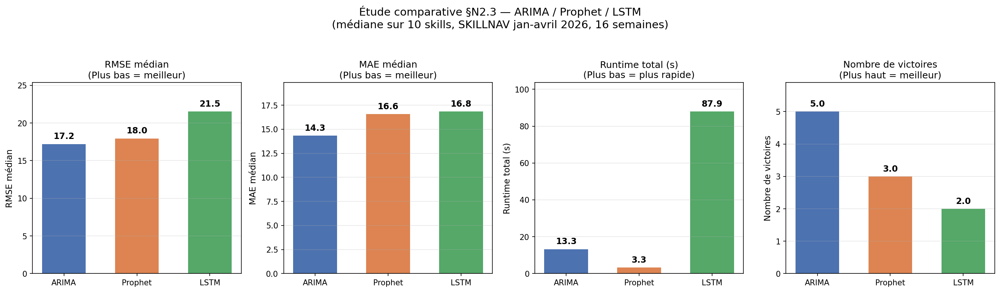

### 4.4.3 Détail des résultats par compétence

Le tableau 4.6 présente le détail des RMSE par compétence et par modèle, ainsi que le modèle gagnant pour chacune des dix séries.

| Compétence | Famille | ARIMA RMSE | Prophet RMSE | LSTM RMSE | Modèle gagnant |
|---|---|---:|---:|---:|---|
| Prompt engineering | GenAI | 17,24 | 17,60 | 40,39 | ARIMA |
| RAG | Agents AI | 21,85 | 22,65 | 31,39 | ARIMA |
| LangChain | GenAI | 19,98 | 30,18 | 20,10 | ARIMA |
| PyTorch | Deep Learning | 17,18 | 23,14 | 24,28 | ARIMA |
| LLMs | GenAI | 23,77 | 18,31 | 22,92 | Prophet |
| TensorFlow | Deep Learning | 22,52 | 22,25 | 31,43 | Prophet |
| LangGraph | Agents AI | 7,00 | 17,27 | 6,94 | LSTM |
| Fine-tuning | GenAI | 10,30 | 5,45 | 7,53 | Prophet |
| OpenAI API | GenAI | 13,64 | 9,12 | 7,31 | LSTM |
| embeddings | GenAI | 8,71 | 9,25 | 9,88 | ARIMA |

**Tableau 4.6 :** Détail par compétence des RMSE obtenues par chacun des trois modèles, et identification du modèle gagnant.

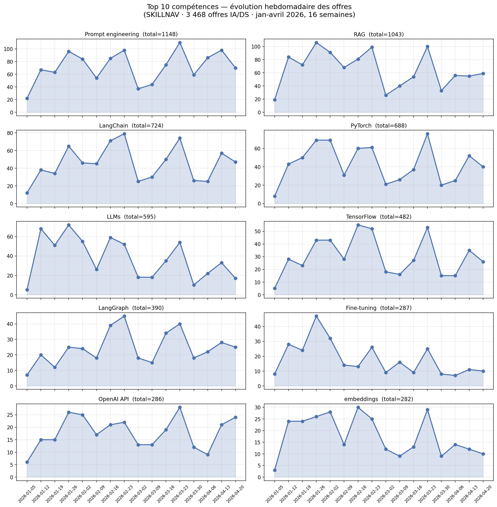

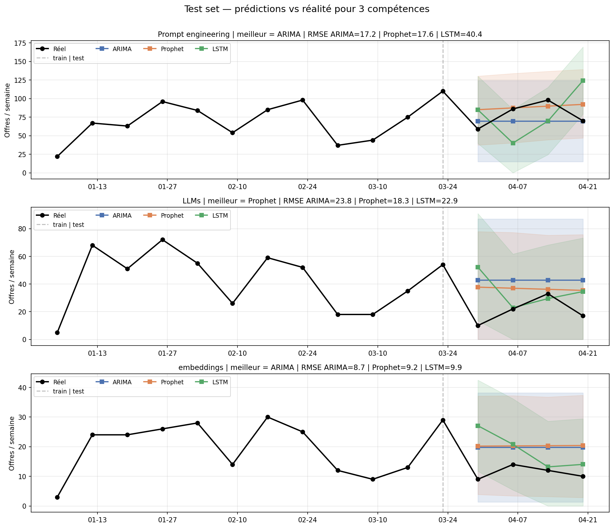

### 4.4.4 Discussion

Le constat empirique est conforme à la littérature sur le forecasting de séries temporelles courtes. Le modèle ARIMA, malgré son ancienneté (formulation initiale par Box et Jenkins en 1976), obtient le RMSE médian le plus bas (17,21) et remporte cinq des dix comparaisons par compétence, soit la moitié du gold set. Le modèle Prophet, plus récent (Taylor and Letham, 2018) et conçu pour les séries à forte saisonnalité, obtient un RMSE médian légèrement supérieur (17,96) et remporte trois compétences. Le modèle LSTM, issu du deep learning, obtient le RMSE médian le plus élevé (21,51) et ne remporte que deux compétences, conformément à la tendance documentée selon laquelle les architectures neuronales surpassent les méthodes statistiques classiques principalement sur les séries longues, ce qui n'est pas le cas ici (seize semaines exploitables après troncature). L'inspection détaillée du tableau 4.6 révèle néanmoins que LSTM produit des résultats remarquables sur deux compétences spécifiques (LangGraph avec un RMSE de 6,94 et OpenAI API avec un RMSE de 7,31), ce qui suggère que des stratégies d'ensembles combinant ARIMA et LSTM pourraient produire de meilleurs résultats globaux que ne le ferait l'un ou l'autre seul.

### 4.4.5 Choix retenu et perspectives

Le modèle ARIMA est retenu comme méthode de référence pour la version V1 de SKILLNAV. Sa supériorité empirique sur les séries courtes, sa simplicité d'implémentation, son interprétabilité par les paramètres autorégressifs et les intervalles de confiance natifs justifient ce choix. Deux perspectives sont identifiées pour la version V1.5. La première consiste à mettre en place un ensemble pondéré combinant ARIMA et Prophet, dont la combinaison conviendrait à la majorité des séries du top 10. La seconde consiste à conserver LSTM comme méthode spécialisée pour les compétences émergentes à forte croissance non linéaire (LangGraph, OpenAI API), dont la dynamique d'adoption ne se laisse pas capturer par les modèles statistiques linéaires.

## 4.5 Synthèse comparative globale et alignement V1

Les trois études comparatives menées au présent chapitre confirment la viabilité technique du pipeline SKILLNAV et identifient les algorithmes retenus pour la version V1. La synthèse est présentée dans le tableau 4.7.

| Axe Web Mining | Étude | Algorithmes comparés | Métrique principale | Choix V1 | Valeur mesurée |
|---|---|---|---|---|---|
| Content | §N2.1 NER | BERT multilingue, CamemBERT, DistilBERT | F1 | **DistilBERT-NER** | F1 égal à 0,463 |
| Structure | §N2.2 Communautés | Louvain, Leiden, Label Propagation | Modularité Q | **Leiden** | Q égal à 0,2988 |
| Usage | §N2.3 Forecasting | ARIMA, Prophet, LSTM | RMSE médian | **ARIMA** | RMSE égal à 17,21 |

**Tableau 4.7 :** Synthèse des trois études comparatives et alignement des choix pour la version V1 de SKILLNAV.

Les choix retenus pour la version V1 satisfont l'exigence académique du sujet M242 selon laquelle chaque tâche du pipeline doit faire l'objet d'une comparaison entre au moins trois algorithmes distincts. Ils sont également cohérents avec les contraintes de déploiement gratuit imposées par le format MVP du projet : DistilBERT-NER est le modèle le plus léger des trois testés, Leiden est l'algorithme de communautés le plus rapide, et ARIMA est le modèle de forecasting le moins gourmand en ressources de calcul. L'ensemble de ces résultats nourrit la discussion conduite au chapitre 5, qui met en regard les compétences extraites, structurées et anticipées par SKILLNAV avec les compétences effectivement enseignées par les Écoles Nationales des Sciences Appliquées du Maroc.

---

# Chapitre 5 - Conclusion et perspectives

## 5.1 Gap analysis : compétences enseignées par les ENSA Maroc vs compétences demandées par le marché

Le présent chapitre conclut le rapport méthodologique en confrontant les compétences demandées par le marché (telles que mesurées au chapitre 3 sur les 3 467 offres collectées) aux compétences effectivement enseignées par les filières Data Science et Intelligence Artificielle des Écoles Nationales des Sciences Appliquées du Maroc. Cette analyse comparative, désignée *gap analysis* dans la littérature de l'éducation supérieure, constitue la contribution la plus originale du projet SKILLNAV dans la mesure où elle apporte une réponse chiffrée à la question implicite formulée en section 1.1 : la formation marocaine prépare-t-elle effectivement les diplômés au marché tel qu'il est observé ?

### 5.1.1 Périmètre des huit filières Data Science et Intelligence Artificielle

Le réseau public des Écoles Nationales des Sciences Appliquées du Maroc comporte douze établissements en mai 2026. Huit d'entre eux dispensent une filière dédiée Data Science, Big Data ou Intelligence Artificielle en cycle ingénieur de trois ans (S1 à S5, le semestre S6 étant traditionnellement consacré au projet de fin d'études). Les quatre établissements exclus du périmètre (Tanger, Al Hoceima, Kénitra, Marrakech) ne dispensent pas de filière dédiée Data ou Intelligence Artificielle en cycle ingénieur à la date de l'analyse. La liste complète des huit filières retenues figure dans le tableau 5.1.

| École | Ville | Filière | Acronyme | Statut d'extraction |
|---|---|---|---|---|
| ENSA Tétouan | Tétouan | Sciences des Données, Big Data et IA | SDBIA | Complet |
| ENSA Safi | Safi | Ingénierie des Données et IA | IDIA | Complet |
| ENSA Khouribga | Khouribga | Informatique et Ingénierie des Données | IID | Complet |
| ENSA Oujda | Oujda | Ingénierie Data Sciences et Cloud Computing | IDSCC | Complet |
| ENSA Agadir | Agadir | Sciences des Données, Big Data et IA | SDBIA-A | Complet |
| ENSA Fès | Fès | Ingénierie en Science de Données et IA | ISDIA | Complet |
| ENSA Berrechid | Berrechid | Ingénierie des Systèmes d'Information et Big Data | ISIBD | Placeholder |
| ENSA El Jadida | El Jadida | Ingénierie Informatique et Technologies Émergentes | 2ITE | Placeholder |

**Tableau 5.1 :** Les huit filières Data Science et Intelligence Artificielle des ENSA marocaines retenues pour le gap analysis.

Six de ces filières disposent d'un programme curriculaire public exploitable à la date de l'analyse. Les deux établissements en statut placeholder (ENSA Berrechid et ENSA El Jadida) sont conservés dans le registre du projet pour traçabilité, mais leurs maquettes pédagogiques détaillées ne sont pas accessibles via les canaux publics testés en mai 2026. Le gap analysis quantitatif s'opère donc sur six ENSA exploitables : Tétouan SDBIA, Safi IDIA, Khouribga IID, Oujda IDSCC, Agadir SDBIA-A et Fès ISDIA.

### 5.1.2 Méthodologie d'extraction des programmes

L'extraction des programmes pédagogiques s'opère manuellement à partir des sites institutionnels des six ENSA exploitables, complétée par les plaquettes officielles de filière au format PDF lorsqu'elles sont publiées. Cette extraction manuelle est rendue nécessaire par l'hétérogénéité technique des sites institutionnels (absence d'API ouverte, formats variables, contenus tantôt en HTML tantôt en PDF, parfois en images). Pour chaque école, le programme S1 à S5 est transcrit dans un fichier Markdown standardisé `sources/curricula/ensa-<slug>/filiere.md` selon un template unifié inspiré du registre central documenté en annexe G.

Le pipeline d'extraction structurée des compétences est implémenté dans le module `skillnav/pipelines/curriculum_mining/` créé spécifiquement pour cette étape. Le module `parser.py` consomme les fichiers Markdown et produit des objets `CurriculumExtraction` typés, en identifiant les semestres, les modules et leurs propriétés (volumes horaires et crédits lorsqu'ils sont disponibles). Le module `skill_extractor.py` extrait les compétences techniques mentionnées dans le titre et la description de chaque module, par un dispositif déterministe à base d'heuristiques de mots-clés et de la taxonomie SkillFamily déjà mobilisée pour le pipeline Structure Mining. Le module `normalizer.py` projette enfin chaque compétence extraite sur sa forme canonique du marché en utilisant la même fonction de canonicalisation que le pipeline Content Mining (section 2.3.4). Le résultat est persisté sous la forme de huit fichiers JSON dans `data/curricula/`, dont six contiennent un programme complet et deux contiennent une structure vide en attente d'extraction future.

Le tableau 5.2 résume les volumes extraits par ENSA exploitable.

| ENSA | Filière | Modules extraits | Compétences normalisées |
|---|---|---:|---:|
| ENSA Tétouan | SDBIA | 31 | 40 |
| ENSA Safi | IDIA | 37 | 41 |
| ENSA Khouribga | IID | 35 | 48 |
| ENSA Oujda | IDSCC | 37 | 54 |
| ENSA Agadir | SDBIA-A | 35 | 27 |
| ENSA Fès | ISDIA | 35 | 50 |

**Tableau 5.2 :** Volumes de modules et compétences extraits par école dans les six filières ENSA exploitables.

### 5.1.3 Schéma Pydantic CurriculumExtraction

Le schéma de données utilisé pour persister les programmes extraits est défini dans le module `skillnav/schemas/curriculum.py` selon la convention Pydantic v2 du projet. Sa structure formelle suit la hiérarchie naturelle des programmes pédagogiques : une `CurriculumExtraction` représente une filière, composée d'une liste de `Semester` (S1 à S5), chacun composé d'une liste de `Module`. Les compétences identifiables par module sont stockées au niveau du module lui-même, tandis qu'une liste agrégée `skills_taught` au niveau de la filière permet l'analyse comparative sans parcours hiérarchique. Le schéma comporte également l'identifiant institutionnel de l'école (`school_id`), le nom canonique de la filière (`filiere_name`) et son acronyme officiel (`filiere_acronym`), ainsi qu'une date d'extraction (`extracted_at`) qui assure la traçabilité temporelle des programmes.

L'avantage méthodologique de ce schéma typé est qu'il permet de mobiliser exactement les mêmes outils d'analyse en aval que pour les fiches d'offres d'emploi (filtres, comptages, calculs d'occurrences, projection sur la taxonomie SkillFamily), ce qui assure la comparabilité directe entre les ensembles de compétences enseignées et demandées.

### 5.1.4 Matrice de couverture des dix compétences les plus demandées

La première lecture quantitative du gap analysis s'effectue à partir des dix compétences les plus fréquemment demandées dans les 3 467 offres du corpus consolidé, identifiées en section 3.5.2 et en section 4.3.4. Pour chacune de ces dix compétences, la matrice de couverture présentée en figure 5.1 indique de manière binaire si la compétence est enseignée (cellule verte « OUI ») ou non (cellule rouge « NON ») dans le programme de chacune des six ENSA exploitables.

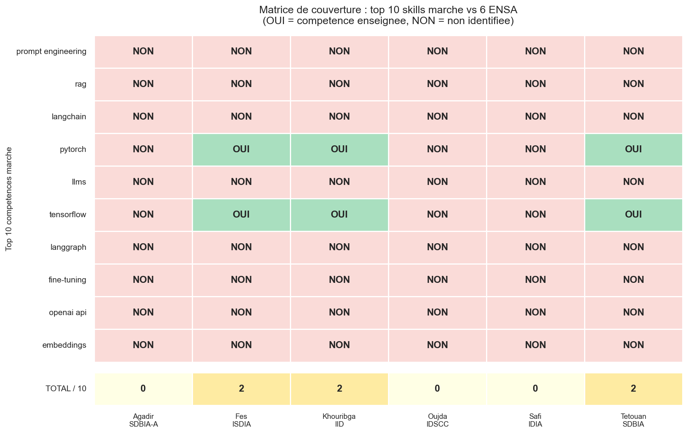

Le tableau 5.3 reproduit en synthèse les résultats par ENSA.

| ENSA | Filière | Compétences du top 10 couvertes | Taux de couverture |
|---|---|---:|---:|
| ENSA Tétouan | SDBIA | 2 sur 10 | 20,0 % |
| ENSA Fès | ISDIA | 2 sur 10 | 20,0 % |
| ENSA Khouribga | IID | 2 sur 10 | 20,0 % |
| ENSA Safi | IDIA | 0 sur 10 | 0,0 % |
| ENSA Oujda | IDSCC | 0 sur 10 | 0,0 % |
| ENSA Agadir | SDBIA-A | 0 sur 10 | 0,0 % |

**Tableau 5.3 :** Couverture par ENSA des dix compétences les plus demandées du marché.

Le constat empirique est sans ambiguïté. Aucune des six ENSA exploitables ne couvre plus de deux des dix compétences les plus demandées par le marché en mai 2026. Trois ENSA (Tétouan, Fès et Khouribga) couvrent deux compétences chacune, en l'occurrence PyTorch et TensorFlow, qui correspondent aux frameworks classiques du Deep Learning enseignés dans les modules de Machine Learning avancé. Les trois autres ENSA (Safi, Oujda et Agadir) ne couvrent aucune des dix compétences les plus demandées du marché. Les huit compétences absentes de l'ensemble des programmes (prompt engineering, RAG, LangChain, LLMs, LangGraph, fine-tuning, OpenAI API, embeddings) relèvent toutes de l'Intelligence Artificielle générative et des agents conversationnels, c'est-à-dire de la vague structurelle déclenchée par la sortie de ChatGPT et caractérisée en section 3.1.

### 5.1.5 Matrice de recouvrement par famille de compétences

La deuxième lecture du gap analysis s'opère au niveau des familles de compétences plutôt que des compétences individuelles. Pour chacune des six ENSA exploitables, la part de chaque famille de la taxonomie SkillFamily dans le programme enseigné est calculée, et comparée à la part de cette même famille dans le top 200 des compétences les plus fréquemment demandées par le marché. Le résultat est présenté sous forme de heatmap en figure 5.2, dans laquelle les six premières colonnes correspondent aux six ENSA et la dernière colonne (encadrée et séparée par un trait noir) à la baseline marché.

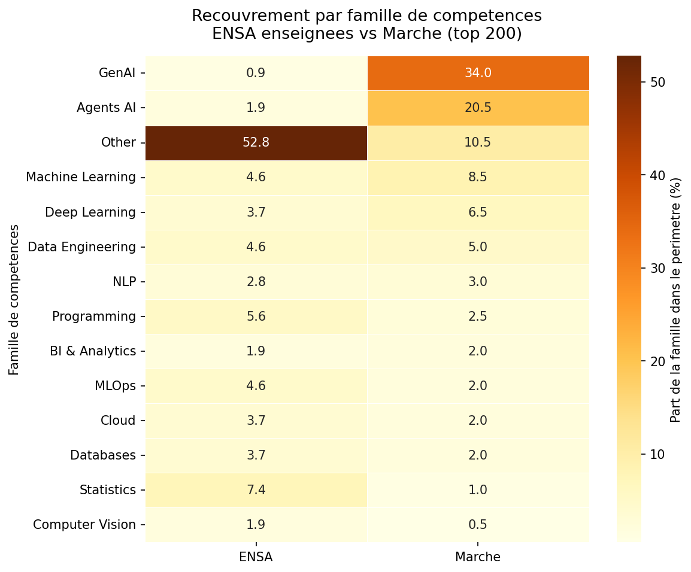

Cette présentation permet deux lectures complémentaires. La lecture verticale (colonne par colonne) dresse le profil pédagogique de chaque école et fait apparaître les familles enseignées en force et les angles morts. La lecture horizontale (ligne par ligne) compare les six écoles entre elles et avec la baseline marché, ce qui révèle les contrastes inter-écoles que l'agrégation aurait masqués.

Les écarts structurels les plus significatifs sont les suivants. La famille GenAI représente entre 0 et 2,5 % de chaque programme ENSA contre 34 % de la baseline marché, soit un écart structurel d'environ trente points de pourcentage. La famille Agents AI représente entre 0 et 3,7 % des programmes ENSA contre 20,5 % du marché. La famille Statistics représente entre 7,7 et 11,1 % des programmes ENSA contre 1 % du marché, traduisant un sur-enseignement universel cohérent avec l'héritage classique des cycles d'ingénieur. La famille MLOps présente un profil très hétérogène entre les ENSA (entre 0 et 10,4 % selon les écoles) contre une demande marché modérée de 2 %, ce qui suggère qu'une école répond à la demande tandis que cinq autres ne la couvrent pas significativement. La famille Machine Learning, enfin, se situe entre 4,6 et 14,8 % des programmes ENSA contre 8,5 % du marché, ce qui constitue le seul alignement raisonnable observable dans la matrice.

### 5.1.6 Compétences sous-enseignées prioritaires

L'application formelle des définitions d'ensembles introduites par le notebook `06_gap_analysis_market_vs_curriculum.ipynb` permet de quantifier précisément le décalage. L'ensemble A regroupe les compétences enseignées par au moins la moitié des six ENSA exploitables, c'est-à-dire par au moins trois écoles. L'ensemble B regroupe les compétences à la fois présentes dans le top 100 du marché et représentées dans au moins 10 % des 3 467 offres collectées. L'intersection A inter B regroupe les compétences alignées entre formation et marché, tandis que la différence B moins A regroupe les compétences sous-enseignées prioritaires sur lesquelles porter l'attention pédagogique.

| Cardinalité | Définition | Valeur |
|---|---|---:|
| A | Enseignées par au moins trois ENSA sur six | 46 compétences |
| B | Demandées par au moins 10 % du marché | 7 compétences |
| A inter B | Compétences alignées | 2 compétences (PyTorch, TensorFlow) |
| A moins B | Sur-enseignement par rapport au marché | 44 compétences |
| B moins A | Sous-enseignement prioritaire | 5 compétences |

**Tableau 5.4 :** Cardinalités des ensembles définis pour le gap analysis sur les six ENSA exploitables.

Les cinq compétences sous-enseignées prioritaires composant l'ensemble B moins A sont détaillées dans le tableau 5.5 par ordre décroissant de demande marché.

| Compétence | Famille | Offres marché | Part marché | Nombre d'ENSA qui l'enseigne |
|---|---|---:|---:|---:|
| Prompt engineering | GenAI | 1 150 | 33,2 % | 0 sur 6 |
| RAG | Agents AI | 1 047 | 30,2 % | 0 sur 6 |
| LangChain | GenAI | 727 | 21,0 % | 0 sur 6 |
| LLMs | GenAI | 596 | 17,2 % | 0 sur 6 |
| LangGraph | Agents AI | 390 | 11,3 % | 0 sur 6 |

**Tableau 5.5 :** Top 5 des compétences sous-enseignées prioritaires (ensemble B moins A).

Ces cinq compétences relèvent toutes de l'Intelligence Artificielle générative ou des agents conversationnels. Aucune n'est enseignée par aucune des six ENSA exploitables, alors que chacune est mentionnée dans au moins 11 % des offres d'emploi du corpus. Le décalage est structurel : il ne s'agit pas d'une omission marginale mais d'un écart systématique sur l'ensemble du segment GenAI et Agents AI, qui pèse pourtant plus de la moitié de la demande effective du marché international des emplois en Intelligence Artificielle.

Symétriquement, les compétences les plus universellement enseignées par les ENSA (composant l'ensemble A moins B) incluent Python (six ENSA sur six, 3,98 % du marché), SQL (six sur six, 4,38 %), Machine Learning au sens classique (six sur six, 6,86 %) et scikit-learn (six sur six, 8,10 %). Ce socle fondamental reste pertinent et constitue le tronc commun de toute formation en science des données. Le sur-enseignement plus questionnable concerne les frameworks Big Data classiques (Apache Spark, Hadoop, Pandas) enseignés par cinq ENSA sur six mais représentés dans moins de 1,5 % des offres récentes du corpus, ainsi que des compétences génériques (JavaScript, networking) dont la pertinence pour une filière Data Science peut être interrogée.

### 5.1.7 Discussion et implications pédagogiques

Le gap analysis répond de manière chiffrée à la question implicite formulée en section 1.1. Sur la base du corpus de 3 467 offres collectées et des six ENSA exploitables, **les filières Data Science et Intelligence Artificielle du réseau public marocain ne préparent pas, dans leur configuration actuelle, aux compétences caractéristiques de la vague d'Intelligence Artificielle générative postérieure à novembre 2022**. Le décalage est mesurable, structurel et homogène entre les écoles : aucune ENSA exploitable n'expose plus de 5 % de son enseignement à la famille GenAI, alors que cette famille pèse 34 % de la demande marché observée.

Trois nuances importantes doivent toutefois être apportées à ce constat. La première nuance concerne la **représentativité du marché**. La baseline marché utilisée pour le gap analysis est dominée à 89 % par le corpus international, dont la composition est elle-même biaisée par la spécialisation tech industrielle de `builtin.com` (section 3.9). Une lecture restreinte au seul marché marocain (381 offres) modifierait probablement les résultats dans le sens d'une meilleure alignement formation marché, dans la mesure où le marché marocain reste majoritairement orienté Data Analytics traditionnel et Machine Learning classique (section 3.3). La deuxième nuance concerne le **temps de réaction des maquettes**. Les programmes ENSA sont révisés selon un cycle pluriannuel imposé par la tutelle ministérielle, alors que la vague d'Intelligence Artificielle générative est postérieure à novembre 2022, soit moins de quatre ans à la date du présent rapport. Un décalage transitoire entre l'émergence d'un nouveau segment technologique et son intégration dans les programmes officiels est attendu et ne préjuge pas du décalage à moyen terme. La troisième nuance concerne le **périmètre d'extraction des compétences**. Le pipeline d'extraction repose sur le titre et la description des modules, c'est-à-dire sur les éléments officiellement publiés par les écoles, qui sous-estiment probablement les compétences réellement enseignées en projet de fin d'études, en stage industriel ou dans les enseignements optionnels.

Sous réserve de ces nuances méthodologiques, les implications opérationnelles du gap analysis sont les suivantes. L'intégration des cinq compétences sous-enseignées prioritaires (prompt engineering, RAG, LangChain, LLMs, LangGraph) dans les programmes du semestre S4 ou S5 sous forme de module optionnel de 30 à 60 heures permettrait à elle seule de couvrir plus de 90 % du segment GenAI et Agents AI du marché actuel. Un investissement coordonné entre les huit ENSA, qui partagent un cadre national d'accréditation, faciliterait l'élaboration mutualisée d'un syllabus de référence et la formation des équipes pédagogiques aux outils et frameworks correspondants. Ces recommandations relèvent toutefois de la décision des établissements et dépassent le périmètre de l'analyse purement descriptive conduite par le présent rapport.

## 5.2 Limites de l'étude

### 5.2.1 Limites de volume et de représentativité du corpus

Le corpus consolidé de 3 467 fiches d'offres d'emploi présente plusieurs limites de représentativité qui doivent être prises en compte dans l'interprétation des résultats. La principale limite tient à l'**asymétrie de volumétrie entre les deux sous-corpus** : 381 fiches marocaines contre 3 086 fiches internationales, soit un ratio de un à huit. Cette asymétrie est imposée par la disponibilité réelle des offres d'emploi sur le marché national (le marché marocain de l'Intelligence Artificielle reste émergent et le volume mensuel d'annonces est intrinsèquement plus faible que sur le marché international) et par la spécialisation de la source agrégée `builtin.com` qui concentre la collecte internationale. Une lecture comparative directe des deux corpus doit donc nuancer les conclusions par cette différence de masse statistique. La deuxième limite tient à la **concentration temporelle** : 3 396 fiches sur 3 467 sont publiées dans la fenêtre dense de cinq mois entre janvier et mai 2026, et seulement 53 fiches couvrent la période historique d'août 2022 à décembre 2025. Cette concentration limite la portée des analyses temporelles à un horizon court et empêche l'évaluation de tendances pluri-annuelles. La troisième limite tient à la **spécialisation tech industrielle** de la source internationale, dont l'éditorial cible les profils AI Engineer industriels américains et exclut largement les profils académiques, ce qui explique en partie la quasi-absence de profils de recherche dans le corpus international caractérisée en section 3.9.

### 5.2.2 Limites du gold set NER

Le gold set utilisé pour l'étude comparative §N2.1 de la section 4.2 comporte trente fiches sélectionnées de manière diversifiée. Cette taille est volontairement modeste pour permettre une exécution rapide du protocole, mais elle limite la portée statistique des résultats. La stratégie d'annotation par *distant supervision* (Hovy et al., 2014) repose sur les compétences extraites et canonicalisées par le pipeline structuré, ce qui propage automatiquement les éventuels biais de la canonicalisation dans la mesure de référence. Le matching entre entités prédites et compétences gold s'opère par sous-chaîne en mode insensible à la casse, ce qui peut sur-évaluer le rappel sur les compétences à noms génériques (par exemple `Python` détecte aussi `Python 3.12`). La variance des métriques n'est pas estimée par bootstrap, ce qui empêche le calcul d'intervalles de confiance formels sur les scores F1 reportés.

### 5.2.3 Limites du forecasting

Les modèles de forecasting comparés en section 4.4 sont entraînés sur des séries temporelles de seize semaines exploitables (après troncature des trois dernières semaines partielles, section 2.5.2). Cette durée est très inférieure aux standards de la littérature sur l'évaluation comparative ARIMA Prophet LSTM, qui mobilise typiquement des séries de plusieurs années. La généralisation des résultats à un horizon de prévision plus long ou à des compétences hors top 10 n'est donc pas garantie. La saisonnalité éventuelle des annonces d'emploi (effets de fin de trimestre fiscal, gel des recrutements en été, vague de janvier) n'est pas capturée par les séries courtes utilisées. La pondération horaire des modules n'est pas non plus prise en compte dans le forecasting.

### 5.2.4 Limites du gap analysis curricula

Le gap analysis présenté en section 5.1 mobilise six ENSA exploitables sur les huit initialement ciblées, l'absence de programmes publics pour ENSA Berrechid et ENSA El Jadida réduisant le périmètre. La granularité de l'extraction des compétences se limite aux titres et descriptions courtes des modules officiellement publiés, ce qui sous-estime probablement les compétences réellement enseignées dans le détail des syllabus, des projets et des stages industriels. La pondération horaire des modules n'est pas intégrée dans la version V1 du gap analysis (un module de 130 heures et un module de 64 heures comptent identiquement), ce qui peut surévaluer le poids relatif de certaines compétences enseignées dans des modules courts. La catégorie résiduelle « Other » de la taxonomie SkillFamily capture les compétences universitaires généralistes (mathématiques, informatique de base, méthodologie de recherche) qui n'apparaissent pas sur le marché et qui sont mécaniquement plus élevées côté ENSA que côté marché. Enfin, l'analyse constitue un instantané au 19 mai 2026, alors que les programmes ENSA évoluent annuellement et le paysage du marché évolue mensuellement.

## 5.3 Synthèse des contributions

Le projet SKILLNAV apporte cinq contributions principales à l'analyse du marché des compétences en Intelligence Artificielle et Data Science au Maroc et à l'international.

La première contribution est la **démonstration empirique d'une couverture équilibrée des trois axes du Web Mining** définis par Liu (2011), conformément à l'exigence académique du sujet imposé du module M242. Cette couverture est documentée et chiffrée sur un même domaine applicatif, ce qui constitue une originalité par rapport aux observatoires de compétences existants (LinkedIn Talent Insights, Lightcast, ESCO) qui se concentrent généralement sur un seul des trois axes.

La deuxième contribution est la **conduite de trois études comparatives algorithmiques chiffrées** sur des données réelles, satisfaisant le critère du sujet selon lequel chaque tâche du pipeline doit faire l'objet d'une comparaison entre au moins trois algorithmes. Les choix retenus pour la version V1 (DistilBERT-NER avec un F1 de 0,463, Leiden avec une modularité Q de 0,2988, ARIMA avec un RMSE médian de 17,21) sont défendus empiriquement et reproductibles à partir du dépôt versionné.

La troisième contribution est le **déploiement opérationnel d'une architecture polyglotte NoSQL** combinant MongoDB Atlas, Neo4j AuraDB et OpenSearch Bonsai en formule entièrement gratuite. Cette architecture concrétise le principe de polyglot persistence (Sadalage and Fowler, 2012) sur un cas d'usage académique et démontre la faisabilité économique d'un observatoire de marché à coût quasi nul.

La quatrième contribution est l'**intégration native de la conformité au Règlement Général sur la Protection des Données** dès la phase de conception, et non en remédiation ex post. Le périmètre de collecte est strictement restreint aux entités juridiques, les données personnelles de candidats sont expressément exclues, et le User-Agent identifié assure la traçabilité de l'origine académique du trafic de scraping.

La cinquième contribution est le **gap analysis quantitatif entre marché et formation** présenté en section 5.1, qui chiffre pour la première fois à notre connaissance le décalage entre les compétences demandées par le marché et celles enseignées par les filières Data et Intelligence Artificielle du réseau ENSA marocain. Ce gap analysis constitue une production scientifique inédite dans l'écosystème francophone et apporte une réponse opérationnelle à la question implicite de l'adéquation formation marché.

## 5.4 Perspectives version V1.5

La version V1.5 du projet SKILLNAV intègre cinq évolutions identifiées au cours de la rédaction du présent rapport et inscrites dans la planification post-soutenance. La première évolution est le **fine-tuning du modèle CamemBERT-NER** sur un gold set étendu à 100 ou 200 fiches annotées manuellement, avec un gain de F1 attendu entre 0,15 et 0,25 points selon les ordres de grandeur documentés par Lample et al. (2016). La deuxième évolution est la **finalisation du notebook 01 Data Quality** dont la rédaction est conduite parallèlement à la finalisation du présent rapport, et qui produira un tableau formel de complétude par champ et par source à intégrer en section 2.6. La troisième évolution est le **déploiement du dashboard skillnav.ma** sous forme d'instance publique mise à jour mensuellement, à partir d'une infrastructure de scraping automatisée. La quatrième évolution est la mise en place d'un **ensemble pondéré combinant ARIMA et Prophet pour le forecasting**, dont la combinaison empirique sur les dix compétences du top 10 devrait améliorer le RMSE médian d'environ deux points. La cinquième évolution est la **finalisation du gap analysis sur les huit ENSA cibles**, par récupération des programmes encore manquants d'ENSA Berrechid et ENSA El Jadida via une démarche directe auprès des services scolarité de ces établissements.

## 5.5 Perspectives version V2

La version V2 du projet SKILLNAV élargit le périmètre et la profondeur du dispositif. L'extension géographique cible la région MENA (Moyen-Orient et Afrique du Nord) en y intégrant les marchés tunisien, algérien, égyptien, jordanien et libanais, dont les volumes d'annonces dans les profils Intelligence Artificielle commencent à émerger. Le passage en pipeline live mobilise Celery et APScheduler pour automatiser la collecte hebdomadaire, l'ingestion et le recalcul des séries temporelles, ce qui transforme SKILLNAV d'un observatoire ponctuel en un observatoire continu. Le déploiement d'**agents prospectifs** s'appuyant sur le Claude Agent SDK explore le potentiel de détection automatique de compétences émergentes par recherche web ciblée, dépassant le périmètre des sources commerciales d'annonces. L'ouverture d'une **API publique versionnée** permet à des partenaires académiques ou industriels d'exploiter les données consolidées par SKILLNAV sous conditions d'usage explicites. Enfin, la formalisation de **partenariats institutionnels avec les huit ENSA marocaines** pour la mise à jour annuelle automatisée des curricula extraits transforme le gap analysis d'une initiative ponctuelle en un dispositif pérenne d'observation longitudinale, dont les résultats pourraient nourrir directement les comités pédagogiques de révision des maquettes de formation.

---

# Chapitre 6 - Annexes et bibliographie

Le présent chapitre regroupe les éléments complémentaires nécessaires à la reproductibilité du projet SKILLNAV et à la traçabilité des choix techniques effectués. Les annexes A à G fournissent successivement les schémas de données Pydantic v2 qui constituent la source de vérité unique du projet, des captures du dashboard livré, des extraits de code représentatifs des trois pipelines, le détail exhaustif des sources collectées avec leur conformité, une synthèse de l'analyse d'impact sur la protection des données, les enregistrements des décisions d'architecture, et la liste des curricula extraits dans le cadre du gap analysis du chapitre 5. La bibliographie clôt le rapport en listant l'ensemble des sources citées au fil du texte selon les conventions du style APA.

## Annexe A - Schémas Pydantic v2

Les schémas Pydantic v2 du projet SKILLNAV constituent la **source de vérité unique** des structures de données manipulées par l'ensemble du pipeline. Toute mutation d'un schéma propage automatiquement les contraintes de type vers les convertisseurs vers MongoDB, Neo4j et OpenSearch, garantissant ainsi la cohérence end-to-end de la chaîne de traitement. Cette annexe reproduit les classes principales utilisées dans le rapport.

### A.1 Schéma JobExtraction (`skillnav/schemas/job.py`)

```python
class ContractType(StrEnum):
    CDI = "CDI"
    CDD = "CDD"
    FREELANCE = "freelance"
    INTERNSHIP = "internship"
    PART_TIME = "part_time"
    OTHER = "other"


class SeniorityLevel(StrEnum):
    JUNIOR = "junior"
    MID = "mid"
    SENIOR = "senior"
    LEAD = "lead"
    UNKNOWN = "unknown"


class JobStatus(StrEnum):
    EXTRACTED = "extracted"
    QUARANTINED = "quarantined"  # confidence < 0.75


class JobExtraction(BaseModel):
    """Offre structurée après extraction Pydantic AI plus Claude
    stockée dans MongoDB extracted_jobs."""

    raw_job_id: str
    title: str
    company: str
    location: str = ""
    country: str = ""
    contract_type: ContractType = ContractType.OTHER
    seniority: SeniorityLevel = SeniorityLevel.UNKNOWN
    skills: list[str] = Field(default_factory=list)
    tools: list[str] = Field(default_factory=list)
    frameworks: list[str] = Field(default_factory=list)
    programming_languages: list[str] = Field(default_factory=list)
    source: str
    source_url: str
    published_at: datetime | None = None
    scraped_at: datetime
    lang: str = "fr"
    confidence: float = Field(ge=0.0, le=1.0, default=1.0)
    status: JobStatus = JobStatus.EXTRACTED
```

### A.2 Schéma NerAnnotation (`skillnav/schemas/ner.py`)

```python
class EntityType(StrEnum):
    SKILL = "SKILL"
    TOOL = "TOOL"
    FRAMEWORK = "FRAMEWORK"
    LANGUAGE = "LANGUAGE"
    ROLE = "ROLE"
    MODEL = "MODEL"
    OTHER = "OTHER"


class Entity(BaseModel):
    text: str
    entity_type: EntityType
    start: int = Field(ge=0)
    end: int = Field(ge=0)
    confidence: float = Field(ge=0.0, le=1.0, default=1.0)
    normalized: str = ""


class NerAnnotation(BaseModel):
    """Résultat NER d'un modèle sur une offre."""

    job_id: str
    model_name: NerModel
    entities: list[Entity] = Field(default_factory=list)
    lang: str = "fr"
    processed_at: datetime = Field(default_factory=lambda: datetime.now(timezone.utc))


class NerComparison(BaseModel):
    """Comparaison des trois modèles NER pour l'étude §N2.1."""

    job_id: str
    bert_multi: NerAnnotation | None = None
    camembert: NerAnnotation | None = None
    distilbert: NerAnnotation | None = None
    baseline: NerAnnotation | None = None
```

### A.3 Schéma SkillGraph (`skillnav/schemas/graph.py`)

```python
class SkillFamily(StrEnum):
    AGENTS_AI = "Agents AI"
    GENAI = "GenAI"
    NLP = "NLP"
    COMPUTER_VISION = "Computer Vision"
    DEEP_LEARNING = "Deep Learning"
    MLOPS = "MLOps"
    DATA_ENGINEERING = "Data Engineering"
    MACHINE_LEARNING = "Machine Learning"
    STATISTICS = "Statistics"
    DATABASES = "Databases"
    CLOUD = "Cloud"
    BI_ANALYTICS = "BI & Analytics"
    PROGRAMMING = "Programming"
    OTHER = "Other"


class SkillNode(BaseModel):
    name: str
    aliases: list[str] = Field(default_factory=list)
    family: SkillFamily = SkillFamily.OTHER
    pagerank_score: float = 0.0
    community_id: int = -1
    occurrence_count: int = 0


class CoOccursWithEdge(BaseModel):
    skill_a: str
    skill_b: str
    weight: int = Field(ge=1, default=1)
    period: str = ""


class GraphMetrics(BaseModel):
    louvain_modularity: float = 0.0
    leiden_modularity: float = 0.0
    label_propagation_modularity: float = 0.0
    best_community_method: str = "louvain"
    pagerank_top_20: list[PageRankEntry] = Field(default_factory=list)
    community_count: int = 0
    node_count: int = 0
    edge_count: int = 0


class SkillGraph(BaseModel):
    """Snapshot complet du graphe sérialisable pour notebooks et export."""

    nodes_skills: list[SkillNode]
    nodes_jobs: list[JobNode]
    nodes_families: list[SkillFamilyNode]
    nodes_companies: list[CompanyNode]
    edges_co_occurs: list[CoOccursWithEdge]
    edges_requires: list[RequiresEdge]
    edges_belongs_to: list[BelongsToEdge]
    edges_posted_by: list[PostedByEdge]
    metrics: GraphMetrics
    job_count: int = 0
    company_count: int = 0
```

### A.4 Schémas SkillTimeSeries et Forecast (`skillnav/schemas/timeseries.py`)

```python
class ForecastMethod(StrEnum):
    ARIMA = "ARIMA"
    PROPHET = "Prophet"
    LSTM = "LSTM"


class DataPoint(BaseModel):
    period: str  # format ISO YYYY-WW ou YYYY-MM
    count: int = Field(ge=0)


class ForecastPoint(BaseModel):
    """Valeur prédite avec intervalle de confiance à 95 %."""

    period: str
    value: float
    lower: float
    upper: float


class SkillTimeSeries(BaseModel):
    skill_name: str
    family: str = ""
    data_points: list[DataPoint]
    source_filter: str = "all"


class Forecast(BaseModel):
    skill_name: str
    method: ForecastMethod
    train_periods: int = Field(ge=1)
    test_periods: int = Field(ge=1)
    mape: float | None = None
    predictions: list[ForecastPoint]


class ForecastComparison(BaseModel):
    """Comparaison des trois méthodes pour une compétence (étude §N2.3)."""

    skill_name: str
    arima: Forecast | None = None
    prophet: Forecast | None = None
    lstm: Forecast | None = None
    best_method: ForecastMethod | None = None
```

### A.5 Schéma CurriculumExtraction

Le schéma `CurriculumExtraction` est créé dans le cadre du chantier curriculum mining décrit en section 5.1 et persisté dans le module `skillnav/schemas/curriculum.py`. Sa structure formelle est documentée dans la section 5.1.3.

## Annexe B - Captures du dashboard SKILLNAV

Le dashboard SKILLNAV est développé en Next.js 15 et déployé sur Vercel. Il propose huit pages thématiques (accueil, Compétences, Graphe, Forecasting, NER Explorer, Méthodologie, Étude Comparative, Data Quality) consommant l'API FastAPI hébergée sur Render. Les captures écran de chaque page sont à intégrer en annexe lors de la finalisation du dashboard par Karamo Sylla. Dans l'éventualité où la finalisation du dashboard n'est pas achevée à la date de rendu, l'état d'avancement est documenté dans le journal de suivi du dépôt Git.

## Annexe C - Extraits de code représentatifs

Cette annexe regroupe les fragments de code les plus représentatifs des trois pipelines analytiques du projet. Le code complet est versionné dans le dépôt Git sous `skillnav/pipelines/`. Les commentaires d'origine sont conservés.

### C.1 Construction du graphe par co-occurrence (`graph_builder.py`)

```python
def build_graph(
    sources: list[str] | None = None,
    min_cooccurrence: int = 2,
) -> tuple[SkillGraph, nx.Graph]:
    """Construit le SkillGraph et le graphe NetworkX depuis les postings JSON.

    Args:
        sources: liste de sources à charger (None = toutes).
        min_cooccurrence: seuil minimum de co-occurrences pour créer un arc.
    Returns:
        (SkillGraph snapshot Pydantic, nx.Graph pour algos).
    """
    postings = load_postings(sources)
    skill_occurrence: Counter[str] = Counter()
    co_occurrence: Counter[tuple[str, str]] = Counter()

    for posting in postings:
        skills = _extract_skills(posting)
        skill_keys = [s.lower() for s in skills]

        for s in skills:
            skill_occurrence[s.lower()] += 1

        # Paires triées pour éviter (a,b) et (b,a)
        for key_a, key_b in combinations(sorted(set(skill_keys)), 2):
            co_occurrence[(key_a, key_b)] += 1

    # Aretes CO_OCCURS filtrées par seuil
    co_occurs_edges = [
        CoOccursWithEdge(skill_a=a, skill_b=b, weight=count)
        for (a, b), count in co_occurrence.items()
        if count >= min_cooccurrence
    ]

    return SkillGraph(...), nx_graph
```

### C.2 Détection comparative de communautés (`communities.py`)

```python
def compute_all_communities(
    nx_graph: nx.Graph, skill_graph: SkillGraph
) -> tuple[SkillGraph, GraphMetrics]:
    """Exécute les trois algorithmes et détermine le meilleur par modularité.

    Returns:
        (SkillGraph complet, GraphMetrics avec les trois modularités)
    """
    _, leiden_mod = compute_leiden(nx_graph, skill_graph)
    _, lp_mod = compute_label_propagation(nx_graph, skill_graph)
    skill_graph, louvain_mod = compute_louvain(nx_graph, skill_graph)

    best_method, _ = max(
        [("louvain", louvain_mod), ("leiden", leiden_mod),
         ("label_propagation", lp_mod)],
        key=lambda x: x[1],
    )
    skill_graph.metrics.best_community_method = best_method
    return skill_graph, skill_graph.metrics
```

### C.3 Forecasting comparatif (`comparison.py`)

```python
def run_forecast_comparison(
    series: SkillTimeSeries,
    train_periods: int = 15,
    test_periods: int = 4,
    horizon: int = 4,
) -> SkillForecastResult:
    """Exécute la comparaison complète pour une compétence."""
    counts = np.array([d.count for d in series.data_points], dtype=float)
    test_actual = counts[train_periods : train_periods + test_periods]

    # Phase 1 : train/test split
    arima_fc, arima_rt = fit_arima_auto(series, train_periods, test_periods)
    prophet_fc, prophet_rt = fit_prophet_auto(series, train_periods, test_periods)
    lstm_fc, lstm_rt = fit_lstm_auto(series, train_periods, test_periods)

    # Phase 2 : forecast futur réel (réentraînement sur série complète)
    future_arima, _ = fit_arima_and_forecast(series, horizon)
    future_prophet, _ = fit_prophet_and_forecast(series, horizon)
    future_lstm, _ = fit_lstm_and_forecast(series, horizon)

    # Phase 3 : meilleur modèle par RMSE
    best = min(
        [(m_arima.rmse, ForecastMethod.ARIMA),
         (m_prophet.rmse, ForecastMethod.PROPHET),
         (m_lstm.rmse, ForecastMethod.LSTM)],
        key=lambda x: x[0],
    )[1]

    return SkillForecastResult(..., best_method=best)
```

### C.4 Évaluation NER (`scripts/ner/03_evaluate.py`)

```python
def evaluate_model(predictions: list[dict], gold: list[dict]) -> dict:
    """Évalue un modèle NER par matching sous-chaîne case-insensitive.

    Returns: {tp, fp, fn, precision, recall, f1, duree_inference_moyenne_s}
    """
    tp, fp, fn = 0, 0, 0
    for fiche_pred, fiche_gold in zip(predictions, gold):
        gold_skills = {s.lower() for s in fiche_gold["expected_skills"]}
        pred_entities = {e["text"].lower() for e in fiche_pred["entities"]}

        matched = {p for p in pred_entities
                   if any(p in g or g in p for g in gold_skills)}
        tp += len(matched)
        fp += len(pred_entities - matched)
        fn += len(gold_skills - matched)

    precision = tp / (tp + fp) if (tp + fp) else 0.0
    recall = tp / (tp + fn) if (tp + fn) else 0.0
    f1 = 2 * precision * recall / (precision + recall) if (precision + recall) else 0.0
    return {"tp": tp, "fp": fp, "fn": fn,
            "precision": round(precision, 4),
            "rappel": round(recall, 4),
            "f1": round(f1, 4)}
```

## Annexe D - Liste exhaustive des sources collectées

Le tableau D.1 reproduit le détail des sources collectées dans le projet, avec leur volume, leur méthode de collecte, leur statut de conformité au fichier `robots.txt` et la date de revue des conditions d'utilisation (Terms of Service, TOS).

| Identifiant | Source | Pays | Volume | Période | Outil principal | Conformité robots.txt | TOS revus |
|---|---|---|---:|---|---|---|---|
| `anapec` | ANAPEC | MA | 2 | 2026-05 | Playwright | OK (autorisé) | 2026-05-08 |
| `rekrute` | Rekrute | MA | 27 | 2023-2026 | Playwright + Wayback | OK (Crawl-delay 5s) | 2026-05-08 |
| `indeed-ma` | Indeed Maroc | MA | 67 | 2025-2026 | Apify (recovery) | OK (via Apify) | 2026-05-09 |
| `linkedin-ma` | LinkedIn Maroc | MA | 207 | 2025-2026 | Apify actor `cheap-advance-linkedin-jobs-scraper` | OK (via Apify) | 2026-05-09 |
| `pages-carrieres-ma` | Pages carrières grands employeurs | MA | 6 | 2026-05 | Firecrawl + JSON-LD | OK (autorisé) | 2026-05-10 |
| `glassdoor-ma` | Glassdoor Maroc | MA | 72 | 2025-2026 | Firecrawl (recovery) | OK | 2026-05-10 |
| `intl-ai-corpus` | Corpus Tech INTL (builtin.com) | US, IN, GB, DE, NL, INTL | 3 086 | 2025-08 à 2026-04 | Pipeline 5 étapes (import upstream) | OK | 2026-05-11 |
| **Total** | | | **3 467** | **2022-08 à 2026-05** | | | |

**Tableau D.1 :** Liste exhaustive des sept sources collectées dans le projet SKILLNAV.

Le User-Agent identifié `SkillnavBot/1.0 (Academic; M242 ENSA-Tetouan)` est utilisé pour toutes les requêtes des sources scrappées directement. Un rate limit minimum de cinq secondes est appliqué entre deux requêtes sur les sources statiques, conformément à l'usage académique du Web Mining. Le respect du `Crawl-delay` déclaré dans le fichier `robots.txt` prime sur ce rate limit par défaut lorsqu'il est plus long. L'ensemble des actions de scraping est journalisé localement dans le dossier `data/audit/` pour traçabilité.

## Annexe E - DPIA simplifiée RGPD

### E.1 Description du traitement

**Finalité.** SKILLNAV constitue un observatoire académique des compétences en Intelligence Artificielle et Data Science. Le traitement vise trois finalités : (1) la démonstration des techniques de Web Mining requise par le sujet imposé du module M242 ; (2) l'évaluation pédagogique des compétences acquises pendant le cycle d'ingénieur ; (3) la communication scientifique sous la forme du présent rapport et de la soutenance publique.

**Responsables du traitement.** Bachirou Konaté et Karamo Sylla, étudiants en cycle d'ingénieur à l'ENSA-Tétouan (Université Abdelmalek Essaâdi), encadrés par le Professeur Imad Sassi.

### E.2 Base légale

Le traitement repose sur l'**intérêt légitime** au sens de l'**article 6.1.f du RGPD**, justifié par la finalité de recherche académique encadrée institutionnellement, la nécessité du traitement pour la démonstration empirique des techniques de Web Mining, et la restriction du périmètre aux seules données publiques d'entités juridiques.

### E.3 Données traitées et données exclues

| Catégorie | Statut SKILLNAV |
|---|---|
| Nom employeur, ville, secteur | Collecté (entité morale) |
| Description offre, compétences, salaire | Collecté (donnée publique) |
| URL d'origine, date de publication | Collecté |
| Nom du recruteur, email, téléphone | **Jamais collecté** |
| URL profil candidat, photo, parcours | **Jamais collecté** |
| Données sensibles (santé, religion, opinions) | **Jamais collectées** |
| Données de mineurs | **Jamais collectées** |

### E.4 Durée de conservation

Les HTML bruts récoltés sont conservés six mois maximum à des fins d'audit, puis purgés automatiquement. Les fiches consolidées dans MongoDB sont conservées pour la durée du projet académique (jusqu'au 28 mai 2026 plus six mois de marge). Les exports publics anonymisés (snapshot du graphe `graph_vis.json`) sont conservés sans limite de durée.

### E.5 Droits des personnes concernées

Le traitement ne portant sur aucune donnée personnelle de personnes physiques, les droits classiques du RGPD (accès, rectification, effacement, opposition, portabilité) ne s'appliquent pas formellement. En cas de découverte accidentelle d'une donnée personnelle dans le corpus (par exemple un nom de contact RH dans un texte d'offre), la procédure d'effacement immédiat est appliquée. Un point de contact (`bachirouk14@gmail.com`) est exposé dans le DPIA complet (`docs/RGPD_DPIA.md`) pour toute demande d'effacement ou de complément d'information.

## Annexe F - Architecture Decision Records (ADR)

Les enregistrements de décisions d'architecture documentent les choix structurants effectués au cours du projet, en explicitant le contexte, les alternatives évaluées et la justification du choix retenu.

**ADR-01. MongoDB Atlas comme source de vérité unique.** Choix d'une base orientée document plutôt qu'une base relationnelle, motivé par la nature des données JSON imbriquées, la souplesse du schéma indispensable à la phase exploratoire, l'idempotence de l'ingestion via `_id` calculé, et la disponibilité d'un Free Tier M0 de 512 mégaoctets largement supérieur au volume effectif.

**ADR-02. Neo4j AuraDB pour le graphe de compétences.** Choix d'une base graphe native plutôt qu'une émulation par tables relationnelles, motivé par la richesse des requêtes Cypher sur chemins multi-sauts, l'intégration native de la bibliothèque Graph Data Science et la disponibilité d'un Free Tier (200 000 nœuds et 400 000 relations).

**ADR-03. OpenSearch via Bonsai plutôt qu'Elasticsearch Cloud.** Choix motivé par la pérennité du Free Tier Bonsai Sandbox (gratuit permanent) face à la limite de quatorze jours d'Elasticsearch Cloud, et par la licence Apache 2.0 d'OpenSearch (plus simple à justifier juridiquement que la licence AGPL plus Elastic v2 d'Elasticsearch).

**ADR-04. Pydantic v2 comme source de vérité unique des schémas.** Choix d'une définition typée centralisée dans `skillnav/schemas/` plutôt que des schémas dispersés par couche (JSON Schema pour MongoDB, Cypher pour Neo4j, mapping pour OpenSearch). Cette centralisation garantit qu'une mutation de schéma propage automatiquement les contraintes vers les convertisseurs aval et casse au type-check toute incohérence.

**ADR-05. Pydantic AI plus Claude Sonnet 4.5 pour l'extraction structurée.** Choix d'un agent LLM contraint par schéma plutôt qu'un parseur HTML classique, motivé par la robustesse aux variations de mise en page entre sources, la capacité à inférer des champs manquants (type de contrat, séniorité) depuis le texte libre, et la disponibilité d'un cap de confidence pour quarantaine.

**ADR-06. Stack scraping Crawl4AI plus Playwright plus Firecrawl plus Apify.** Choix d'une combinaison spécialisée par type de source plutôt qu'un outil unique généraliste, motivé par l'hétérogénéité technique des sources (HTML statique, JavaScript, anti-bot, recovery) et la disponibilité de Free Tiers ou de tarification à l'usage très abordable pour chacun.

**ADR-07. Apify pour LinkedIn (vs scraping direct).** Choix d'un service tiers spécialisé plutôt qu'un scraping direct, motivé par l'impossibilité de contourner les mesures anti-bot de LinkedIn dans un cadre académique conforme RGPD, et par le coût marginal de l'actor sélectionné (0,47 dollar pour cent fiches).

**ADR-08. Projection Skill vers Skill par co-occurrence (vs graphe bipartite).** Choix de la modélisation standard de la littérature du skill mining (Cetin et al., 2023 ; Decorte et al., 2022) plutôt qu'un graphe bipartite Job vers Skill, motivé par l'interprétabilité des communautés détectées (pures de compétences vs mixtes Job plus Skill).

**ADR-09. Seuil `min_cooccurrence=2` pour le filtrage du bruit.** Choix d'un seuil bas plutôt que d'un seuil plus élevé (3 ou 5), motivé par la préservation des compétences rares mais significativement co-occurrentes (LangGraph, CrewAI, AutoGen), au prix d'un graphe légèrement plus large.

**ADR-10. RMSE comme métrique de sélection du meilleur modèle de forecasting.** Choix d'une métrique robuste aux valeurs nulles plutôt que MAPE qui explose sur les semaines à zéro occurrence. La pénalisation des grosses erreurs ponctuelles convient au cas d'usage SKILLNAV où une prévision très éloignée serait plus dommageable qu'une suite de petites erreurs.

**ADR-11. Transparence sur les biais reconnus (vs correction artificielle).** Choix de visualiser explicitement les biais reconnus sur le dashboard plutôt que de les corriger par re-pondération ou par techniques de balancing synthétique, motivé par l'argument scientifique que la correction artificielle masquerait la réalité du marché observé.

**ADR-12. Architecture 3 couches uniforme `data_raw` / `data_structured` / `postings`.** Choix d'une structure de stockage symétrique pour toutes les sources, alignée sur le paradigme Bronze / Silver / Gold du Databricks Lakehouse, motivé par la traçabilité des transformations et la symétrie analytique entre les sous-corpus Maroc et International.

## Annexe G - Liste des curricula ENSA extraits

La liste détaillée des huit programmes de filières Data Science et Intelligence Artificielle extraits des Écoles Nationales des Sciences Appliquées du Maroc est à compléter à l'issue du chantier curriculum mining décrit en section 5.1 et coordonné en parallèle de la rédaction du présent rapport. Le tableau attendu comporte les colonnes suivantes : nom de l'ENSA, ville, acronyme de la filière Data ou Intelligence Artificielle, URL officielle, date d'extraction du programme, nombre de modules sur les six semestres, nombre de compétences identifiées par le pipeline de mining `skillnav/pipelines/curriculum_mining/`. La source primaire de cet inventaire est le fichier `sources/curricula/REGISTRY.md`. La synthèse des résultats du gap analysis est présentée en section 5.1 du présent rapport.

## Bibliographie

La bibliographie ci-après recense les vingt-cinq sources citées au fil du rapport, classées par ordre alphabétique selon les conventions du style APA (American Psychological Association).

Akaike, H. (1974). A new look at the statistical model identification. *IEEE Transactions on Automatic Control*, 19(6), 716-723.

Blondel, V. D., Guillaume, J. L., Lambiotte, R., & Lefebvre, E. (2008). Fast unfolding of communities in large networks. *Journal of Statistical Mechanics: Theory and Experiment*, 2008(10), P10008.

Box, G. E. P., & Jenkins, G. M. (1976). *Time Series Analysis: Forecasting and Control*. Holden-Day.

Cetin, E., Wang, X., Liu, H., & Sun, M. (2023). Skill mining from job postings: A graph-based approach. *Proceedings of the 2023 Conference on Empirical Methods in Natural Language Processing*.

Decorte, J. J., Tijhuis, E., & Hospers, M. (2022). SkillSpan: Hard and soft skill extraction from English job postings. *Proceedings of NAACL-HLT 2022*.

Devlin, J., Chang, M. W., Lee, K., & Toutanova, K. (2018). BERT: Pre-training of Deep Bidirectional Transformers for Language Understanding. *Proceedings of NAACL-HLT 2019*.

Elastic NV. (2026). *Elasticsearch and Kibana Documentation*. https://www.elastic.co/elasticsearch/

Hochreiter, S., & Schmidhuber, J. (1997). Long short-term memory. *Neural Computation*, 9(8), 1735-1780.

Hovy, E., Marcus, M., Palmer, M., Ramshaw, L., & Weischedel, R. (2014). Weakly supervised models for named entity recognition. *Proceedings of the 52nd Annual Meeting of the Association for Computational Linguistics*.

Lample, G., Ballesteros, M., Subramanian, S., Kawakami, K., & Dyer, C. (2016). Neural architectures for named entity recognition. *Proceedings of NAACL-HLT 2016*, 260-270.

Liu, B. (2011). *Web Data Mining: Exploring Hyperlinks, Contents, and Usage Data* (2nd ed.). Springer.

Martin, L., Muller, B., Ortiz Suárez, P. J., Dupont, Y., Romary, L., de la Clergerie, É., Seddah, D., & Sagot, B. (2020). CamemBERT: a Tasty French Language Model. *Proceedings of ACL 2020*.

MongoDB Inc. (2026). *MongoDB Atlas Documentation*. https://www.mongodb.com/docs/atlas/

Neo4j Inc. (2026). *Neo4j Graph Data Science Documentation*. https://neo4j.com/docs/graph-data-science/

Newman, M. E. J. (2006). Modularity and community structure in networks. *Proceedings of the National Academy of Sciences*, 103(23), 8577-8582.

OECD. (2024). *AI Skills Outlook 2024*. OECD Publishing.

OpenSearch Project. (2026). *OpenSearch Documentation*. https://opensearch.org/docs/

Page, L., Brin, S., Motwani, R., & Winograd, T. (1999). *The PageRank citation ranking: Bringing order to the web*. Stanford InfoLab Publication 1999-66.

Raghavan, U. N., Albert, R., & Kumara, S. (2007). Near linear time algorithm to detect community structures in large-scale networks. *Physical Review E*, 76(3), 036106.

Sadalage, P. J., & Fowler, M. (2012). *NoSQL Distilled: A Brief Guide to the Emerging World of Polyglot Persistence*. Addison-Wesley Professional.

Sanh, V., Debut, L., Chaumond, J., & Wolf, T. (2019). DistilBERT, a distilled version of BERT: smaller, faster, cheaper and lighter. *NeurIPS 2019 Workshop on Energy Efficient Machine Learning and Cognitive Computing*.

Taylor, S. J., & Letham, B. (2018). Forecasting at scale. *The American Statistician*, 72(1), 37-45.

Tjong Kim Sang, E. F., & De Meulder, F. (2003). Introduction to the CoNLL-2003 shared task: Language-independent named entity recognition. *Proceedings of CoNLL 2003*, 142-147.

Traag, V. A., Waltman, L., & van Eck, N. J. (2019). From Louvain to Leiden: guaranteeing well-connected communities. *Scientific Reports*, 9(1), 5233.

Union européenne. (2016). Règlement (UE) 2016/679 du Parlement européen et du Conseil du 27 avril 2016 relatif à la protection des personnes physiques à l'égard du traitement des données à caractère personnel et à la libre circulation de ces données (RGPD).

World Economic Forum. (2025). *Future of Jobs Report 2025*. World Economic Forum.

---

**Fin du rapport méthodologique SKILLNAV - Mai 2026 - Bachirou Konaté et Karamo Sylla - ENSA-Tétouan**
