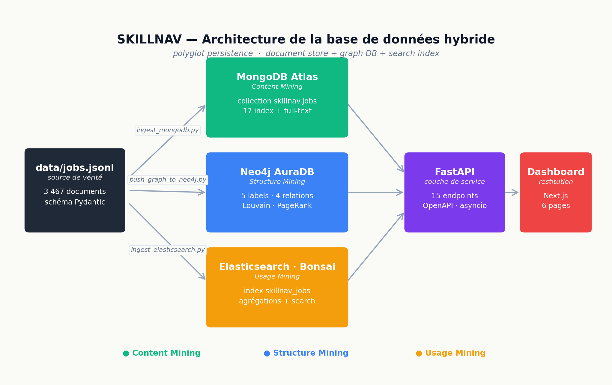

# Livrable 2 — Base de données hybride

> Module M242 « Analyse de Web » · ENSA-Tétouan · Pr. Imad Sassi
> Karamo Sylla & Bachirou Konaté

Ce document décrit la base de données du projet SKILLNAV. L'architecture
retenue est volontairement **hybride** : trois technologies de stockage, chacune
utilisée pour ce qu'elle fait le mieux. C'est un principe d'architecture appelé
*polyglot persistence*, devenu standard dans les systèmes Data modernes.

---

## Sommaire

1. [Vue d'ensemble](#1-vue-densemble)
2. [Pourquoi un système hybride](#2-pourquoi-un-système-hybride)
3. [Schéma d'architecture](#3-schéma-darchitecture)
4. [Chiffres de remplissage](#4-chiffres-de-remplissage)
5. [Source de vérité et conversion](#5-source-de-vérité-et-conversion)
6. [Reproduire la base à partir de zéro](#6-reproduire-la-base-à-partir-de-zéro)
7. [Détails par technologie](#7-détails-par-technologie)
8. [Captures de preuve](#8-captures-de-preuve)
9. [Conformité RGPD](#9-conformité-rgpd)

---

## 1. Vue d'ensemble

| Couche | Technologie | Rôle dans SKILLNAV | Axe Web Mining |
|---|---|---|---|
| Document store | **MongoDB Atlas** (free tier) | Stocke les 3 467 fiches d'offres complètes (texte, métadonnées, skills extraits) | Content Mining |
| Graph DB | **Neo4j AuraDB** (free tier) | Stocke les relations Skill ↔ Skill, Skill ↔ Job, Skill ↔ Famille, Company ↔ Job | Structure Mining |
| Search index | **Elasticsearch / Bonsai** (OpenSearch 2.x, sandbox) | Recherche full-text + agrégations temporelles et thématiques | Usage Mining |

Toutes les trois sont alimentées à partir du même fichier pivot
`data/jobs.jsonl` (3 467 documents), produit par le pipeline de collecte
(livrable 1). Cette source de vérité unique garantit que les trois bases
restent cohérentes entre elles.

---

## 2. Pourquoi un système hybride

Aucune base ne sait tout faire correctement. Le tableau ci-dessous rappelle les
forces et limites de chaque paradigme, et justifie le choix d'un trio.

| Question typique du projet | Mongo seul | Neo4j seul | Elasticsearch seul | Trio |
|---|:-:|:-:|:-:|:-:|
| Stocker la description complète d'une offre | ✅ | ⚠️ inadapté | ⚠️ texte non normalisé | ✅ |
| Calculer les communautés Louvain sur 2 000+ compétences | ⚠️ via map-reduce, lent | ✅ natif (GDS) | ❌ | ✅ |
| Recherche full-text « python pandas pyspark » avec scoring BM25 | ⚠️ text index basique | ❌ | ✅ natif | ✅ |
| Compter les offres par mois et par famille métier | ✅ aggregation pipeline | ⚠️ via Cypher complexe | ✅ aggregations rapides | ✅ |
| Trouver les compétences voisines d'une compétence donnée | ⚠️ jointures lentes | ✅ MATCH (s)-[:CO_OCCURS_WITH]-(n) | ❌ | ✅ |
| Servir le dashboard sans pré-calcul | ⚠️ partiel | ✅ pour le graphe | ✅ pour la recherche | ✅ |

Le coût d'un système triple — plus de scripts d'ingestion, plus de schémas à
maintenir — est compensé par la clarté du modèle : **chaque base stocke
exactement ce qu'elle seule sait bien stocker**, sans duplication inutile.

### Anti-modèles évités

* **Le full-Mongo** : possible, mais le calcul des communautés et du PageRank
  exigerait soit `$graphLookup` (lent à grande échelle), soit une couche Python
  qui réimplémente les algos. Neo4j fait ça en natif via la library GDS.
* **Le full-Neo4j** : possible, mais Neo4j n'est pas un magasin de texte. Les
  descriptions de 800-2 000 caractères y deviennent du tracking de propriétés
  difficile à interroger en agrégation.
* **Le full-ES** : possible mais aplatit le graphe — toute relation Skill ↔ Job
  devient un index inversé, on perd la possibilité de traverser le graphe.

---

## 3. Schéma d'architecture



Trois étapes :

1. **Ingestion** depuis le fichier pivot `data/jobs.jsonl` vers les trois
   bases via trois scripts dédiés (`scripts/ingestion/` et
   `scripts/push_graph_to_neo4j.py`).
2. **Consommation** par l'API FastAPI (15 endpoints) qui interroge la base la
   plus appropriée selon la question posée.
3. **Affichage** par le dashboard Next.js qui consomme l'API.

---

## 4. Chiffres de remplissage

| Base | Cible | Volume |
|---|---|---|
| MongoDB Atlas | collection `skillnav.jobs` | **3 467 documents** |
| Neo4j AuraDB | 5 labels, 4 relations | voir détail dans [`schemas/neo4j_graph_model.md`](schemas/neo4j_graph_model.md) |
| Elasticsearch / Bonsai | index `skillnav_jobs` | **3 467 documents** |

Distribution des 3 467 fiches :

* Maroc : 381 fiches
* International : 3 086 fiches
* Période de publication couverte : août 2022 → mai 2026 (25 mois)
* 13 familles métier représentées (Data Scientist, ML Engineer, AI Engineer, etc.)

---

## 5. Source de vérité et conversion

Le schéma Pydantic est **la** source de vérité du projet. Toute donnée
manipulée par le code est typée par un modèle dans `skillnav/schemas/`.

```
skillnav/schemas/
├── job.py          RawJob, JobExtraction         → MongoDB.jobs / Elasticsearch
├── graph.py        SkillNode, JobNode, Edge      → Neo4j
├── ner.py          NerAnnotation, Entity         → MongoDB.ner_annotations
├── timeseries.py   SkillTimeSeries, Forecast     → MongoDB.skills_timeseries
├── curriculum.py   CurriculumExtraction          → MongoDB.curricula
└── converters/
    └── to_neo4j.py push_graph_to_neo4j()
```

L'avantage : si on modifie un champ dans un schéma Pydantic, le type-check
remonte automatiquement l'incompatibilité dans tous les converters.

---

## 6. Reproduire la base à partir de zéro

À partir d'un poste vierge (et après avoir renseigné `.env` avec
`MONGODB_URI`, `NEO4J_URI`, `NEO4J_USER`, `NEO4J_PASSWORD`, `ELASTIC_URL`) :

```bash
# 1. Reconstruire le fichier pivot depuis le corpus collecté
python scripts/build_dataset.py

# 2. Ingérer dans MongoDB Atlas
python scripts/ingestion/ingest_mongodb.py

# 3. Ingérer dans Elasticsearch (Bonsai)
python scripts/ingestion/ingest_elasticsearch.py

# 4. Construire le graphe + pousser dans Neo4j AuraDB
python scripts/push_graph_to_neo4j.py
```

Chaque script est **idempotent** : on peut le relancer sans craindre les
doublons (upsert par `_id` côté Mongo, `REPLACE` côté ES, `MERGE` côté Cypher).

Durée totale sur une connexion fibre : ~3 à 5 minutes.

---

## 7. Détails par technologie

Trois documents séparés détaillent le schéma exact de chaque base :

* [`schemas/mongo_collections.md`](schemas/mongo_collections.md) — collections, champs, indexes
* [`schemas/neo4j_graph_model.md`](schemas/neo4j_graph_model.md) — labels, relations, contraintes
* [`schemas/elasticsearch_index.md`](schemas/elasticsearch_index.md) — mapping, analyzers

Et trois fichiers d'exemples de requêtes (résultats inclus) :

* [`queries/mongo_examples.md`](queries/mongo_examples.md)
* [`queries/neo4j_examples.cypher`](queries/neo4j_examples.cypher)
* [`queries/elasticsearch_examples.md`](queries/elasticsearch_examples.md)

---

## 8. Captures de preuve

Les trois bases sont effectivement provisionnées et peuplées. Les captures
des consoles d'administration sont dans `screenshots/` :

* `atlas_dashboard.png` — vue de la collection `skillnav.jobs` avec
  3 467 documents
* `neo4j_graph_view.png` — vue d'un sous-graphe dans Neo4j Browser
* `bonsai_stats.png` — vue des statistiques d'index Bonsai

---

## 9. Conformité RGPD

Aucune donnée personnelle de candidat n'a été stockée — ni dans le pivot, ni
dans les bases :

| Règle | Application |
|---|---|
| Données personnelles de candidat | Aucune (pas de nom, email, téléphone, photo, profil LinkedIn perso) |
| Entités morales uniquement | Nom employeur (ou « Anonyme ») + descriptions publiques d'offres |
| User-Agent identifié | `SkillnavBot/1.0 (Academic; M242 ENSA-Tetouan)` |
| Rate limit | ≥ 5 secondes entre requêtes sur sources statiques |
| `robots.txt` | Vérifié pour chaque source avant collecte |

Le détail est dans le document RGPD du projet (volet collecte) :
[`SKILLNAV-COLLECT/sources/COLLECTION_PROTOCOL.md`](https://github.com/Kaaramo/SKILLNAV-COLLECT/blob/main/sources/COLLECTION_PROTOCOL.md#1-périmètre).
