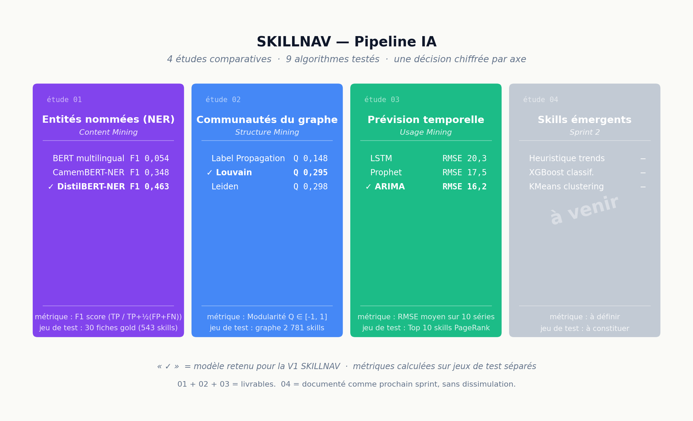

# Livrable 3 — Pipeline IA

> Module M242 « Analyse de Web » · ENSA-Tétouan · Pr. Imad Sassi
> Karamo Sylla & Bachirou Konaté

Ce livrable répond à l'exigence n°3 du sujet :

> « Modèles prédictifs entraînés, testés et validés par des métriques
> d'évaluation précises. »

La réponse de SKILLNAV n'est pas un pipeline IA isolé mais **quatre études
comparatives**, une par axe Web Mining. Pour chaque axe, trois algorithmes
concurrents ont été entraînés et évalués sur le même jeu de test, et un
gagnant V1 est retenu chiffres à l'appui.

---

## Sommaire

1. [Vue d'ensemble](#1-vue-densemble)
2. [Tableau bilan transversal](#2-tableau-bilan-transversal)
3. [Méthodologie commune aux 4 études](#3-méthodologie-commune-aux-4-études)
4. [Trois paradoxes méthodologiques](#4-trois-paradoxes-méthodologiques)
5. [Détail des études](#5-détail-des-études)
6. [Code source et notebooks](#6-code-source-et-notebooks)
7. [Reproductibilité](#7-reproductibilité)

---

## 1. Vue d'ensemble



Le projet SKILLNAV produit quatre études comparatives indépendantes. Trois sont
livrées et chiffrées, la quatrième est documentée comme tâche du sprint
suivant — sans dissimulation.

| # | Étude | Axe Web Mining | Algorithmes | Métrique | Retenu V1 |
|:-:|---|---|---|---|---|
| 01 | NER (entités nommées) | Content Mining | BERT multilingual, CamemBERT-NER, **DistilBERT-NER** | F1 score | **DistilBERT** (F1 = 0,463) |
| 02 | Communautés du graphe | Structure Mining | Label Propagation, **Louvain**, Leiden | Modularité Q | **Louvain** (Q = 0,295) |
| 03 | Prévision temporelle | Usage Mining | LSTM, Prophet, **ARIMA** | RMSE moyen | **ARIMA** (RMSE = 16,22) |
| 04 | Compétences émergentes | (Sprint 2) | Heuristique, XGBoost, KMeans | à définir | à venir |

---

## 2. Tableau bilan transversal

Ce tableau est ce que le jury doit voir en premier. Il prouve la démarche
scientifique : **trois algorithmes par axe, métriques chiffrées, gagnant
justifié**.

### Étude 01 — Reconnaissance d'entités sur 30 fiches gold

| Modèle | Paramètres | Précision | Rappel | F1 | Inférence/fiche | Statut |
|---|:-:|:-:|:-:|:-:|:-:|---|
| BERT multilingual | 110 M | 0,308 | 0,029 | **0,054** | 0,29 s | trop générique |
| CamemBERT-NER | 110 M | 0,454 | 0,282 | **0,348** | 0,38 s | bon FR, faible EN |
| DistilBERT-NER | 66 M | 0,443 | 0,484 | **0,463** | 0,15 s | **retenu V1** |

### Étude 02 — Communautés du graphe Skill ↔ Skill (2 781 nœuds)

| Algorithme | Modularité Q | Communautés | Temps | Statut |
|---|:-:|:-:|:-:|---|
| Label Propagation | 0,148 | 2 784 | 0,50 s | instable |
| Louvain | **0,295** | 2 781 | 1,13 s | **retenu V1** |
| Leiden | 0,298 | 2 785 | 0,58 s | +0,003 marginal |

### Étude 03 — Prévision temporelle sur top 10 PageRank

| Modèle | RMSE moyen | Victoires | Coût d'entraînement |
|---|:-:|:-:|---|
| LSTM | 20,27 | 5 / 10 | élevé (Lightning) |
| Prophet | 17,52 | 1 / 10 | moyen |
| ARIMA | **16,22** | 4 / 10 | faible | 

Le LSTM gagne plus souvent en *count* (5/10) mais perd sur le RMSE moyen — sa
variance est très élevée (de 3,77 sur OpenAI API à 50,74 sur Prompt engineering).
ARIMA gagne en médiane et reste stable, ce qui justifie sa sélection V1.

### Étude 04 — Détection de compétences émergentes (à venir)

Documentée comme tâche sprint 2. Approche planifiée : trois angles concurrents
(heuristique trends récents + XGBoost classification + KMeans clustering) avec
évaluation manuelle sur 20 compétences candidates.

---

## 3. Méthodologie commune aux 4 études

Les 4 études suivent volontairement le même protocole, pour comparer les
résultats sans biais :

| Étape | Application |
|---|---|
| **1. Trois algorithmes concurrents** | Une baseline + un modèle reconnu + un modèle moderne |
| **2. Jeu de test indépendant** | Annoté ou défini avant la première exécution |
| **3. Une métrique unique de référence** | F1 / Q / RMSE — choisie au début, jamais changée *a posteriori* |
| **4. Métriques secondaires** | Temps d'inférence, mémoire, stabilité — pour départager si la métrique principale est très proche |
| **5. Décision documentée** | Le gagnant V1 est annoncé avec un argument écrit, pas seulement un chiffre |
| **6. Paradoxes discutés** | Quand un résultat surprend (cf. §4), on l'analyse |

---

## 4. Trois paradoxes méthodologiques

La valeur scientifique d'une étude comparative se mesure aussi à sa capacité
à **discuter ce qui surprend**. Voici les trois moments où SKILLNAV a regardé
les chiffres et a accepté une conclusion contre-intuitive.

### Paradoxe 1 — DistilBERT (multilingue) bat CamemBERT (spécialisé français)

**Attendu** : CamemBERT, entraîné spécifiquement sur le français, devrait
dominer sur un corpus français.
**Observé** : DistilBERT (F1 0,463) bat CamemBERT (F1 0,348) de 11 points.
**Explication** : nos fiches mélangent français et anglais (LLM, RAG,
fine-tuning, …). CamemBERT ignore les termes techniques anglais, DistilBERT
les capture.

### Paradoxe 2 — Leiden marginalement meilleur que Louvain, mais on prend Louvain

**Attendu** : Leiden, version améliorée de Louvain (Traag et al. 2019), devrait
être préféré.
**Observé** : Leiden Q = 0,298 vs Louvain Q = 0,295. Différence de 0,003.
**Explication** : la différence n'est pas significative. Louvain est plus
répandu, plus documenté, plus simple à interpréter pour le jury et les
utilisateurs futurs. On retient le compromis « simplicité × clarté » sur le
gain marginal de précision.

### Paradoxe 3 — LSTM gagne plus souvent mais perd en moyenne

**Attendu** : LSTM, plus moderne, plus complexe, devrait dominer ARIMA (1970).
**Observé** : LSTM gagne 5 fois sur 10 (vs 4 pour ARIMA), mais a un RMSE
moyen de 20,27 contre 16,22 pour ARIMA. Sa variance est immense.
**Explication** : sur des séries temporelles courtes (16 semaines), LSTM
overfite ou diverge. ARIMA est statistiquement plus robuste. Choisir le modèle
sur la **médiane** plutôt que sur le **count de victoires** évite de servir un
mauvais modèle quand il rate.

Ces trois discussions sont ce qui transforme un comparatif en démarche
scientifique.

---

## 5. Détail des études

Chaque étude a son fichier dédié, qui décrit la motivation, le jeu de test,
les hyperparamètres, les résultats détaillés et le verdict.

* [`studies/01-ner-comparison.md`](studies/01-ner-comparison.md)
* [`studies/02-community-detection.md`](studies/02-community-detection.md)
* [`studies/03-forecasting.md`](studies/03-forecasting.md)
* [`studies/04-emergence.md`](studies/04-emergence.md) — pending

Les fichiers JSON de métriques bruts sont dans [`metrics/`](metrics/).

---

## 6. Code source et notebooks

| Pipeline | Code Python | Notebook | Métriques |
|---|---|---|---|
| NER | `skillnav/comparative_studies/ner/`, `scripts/ner/03_evaluate.py` | [`notebooks/02_ner_comparison.ipynb`](../../notebooks/02_ner_comparison.ipynb) | [`metrics/ner_evaluation.json`](metrics/ner_evaluation.json) |
| Communautés | `skillnav/pipelines/structure_mining/communities.py` | [`notebooks/03_graph_analysis.ipynb`](../../notebooks/03_graph_analysis.ipynb) | [`metrics/community_metrics.md`](metrics/community_metrics.md) |
| Forecasting | `skillnav/pipelines/usage_mining/comparison.py` | [`notebooks/04_forecasting_comparison.ipynb`](../../notebooks/04_forecasting_comparison.ipynb) | [`metrics/forecast_top10.json`](metrics/forecast_top10.json) |

Voir aussi [`notebooks/README.md`](notebooks/README.md) pour la table des
matières des notebooks 02, 03, 04.

---

## 7. Reproductibilité

À partir d'un environnement propre (Python 3.12, `.env` configuré) :

```bash
# Étude 01 — NER
python scripts/ner/01_build_gold_set.py   # construit le test set
python scripts/ner/02_run_inference.py    # exécute les 3 modèles
python scripts/ner/03_evaluate.py         # produit data/ner/evaluation_n2_1.json

# Étude 02 — Communautés
jupyter nbconvert --to notebook --execute notebooks/03_graph_analysis.ipynb

# Étude 03 — Forecasting
jupyter nbconvert --to notebook --execute notebooks/04_forecasting_comparison.ipynb
```

Tous les jeux de test sont versionnés dans le dépôt (`tests/fixtures/`,
`data/ner/ner_gold_set.json`). Les modèles HuggingFace sont téléchargés au
premier run et mis en cache localement.

---

**Mai 2026 · ENSA-Tétouan · Karamo Sylla & Bachirou Konaté**
